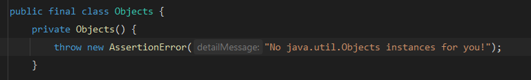

# Java's Little Heresies: A Tour of Its Funniest Quirks

Let's get one thing straight: Java is a titan of the programming world. It's robust, powerful, and has been the trusted workhorse for countless corporations for over three decades. Powering everything from tiny smart cards to colossal enterprise systems, its reputation for stability is well-earned.

And that's precisely what makes its oddities so delightful.

Over its long and storied journey, Java has collected a fascinating gallery of quirks: vestiges of a different era, curious design trade-offs, and syntax that just makes you tilt your head. Some might even call them... heresies.

So today, let's put aside the serious architectural discussions and take a lighthearted tour through some of Java's most amusing quirks. These are the moments that make us chuckle, scratch our heads, and appreciate that even the most mature languages have a peculiar side.

And no, those heresies won't get you ~~or Java~~ get incinerated by the inquisitors. But knowing those may help you a little bit more when it comes to work.

<!--truncate-->

## When 1000 is **NOT** 1000

Let's look at this bizarre example:

```java
Integer a = 100;
Integer b = 100;

Integer c = 1000;
Integer d = 1000;

System.out.println(a == b); // true
System.out.println(c == d); // false
```

What's happening here? Let's rewind our knowledge a bit.

The rule of thumb in Java: in most cases, never compare the value of two objects using the `==` operator. You'll most likely end up with a `false` result.

There are exceptions, for example, it's perfectly fine to compare Java `enum` objects of the same type using `==`, and maybe some strings whose values are interned into the String Pool. But it's better safe than sorry (and yes, you can perfectly compare them using `.equals()` just fine).

But back to our little lovely heresy, there's also another fun party at work here.

For performance optimization, `Integer` *objects* from `-128` to `127` are cached (depending on JVM implementations). Therefore, both `Integer a = 100` and `Integer b = 100` are pointing to the same reference of `Integer 100`, and thus `(a == b)` is `true`. Outside this range, every object gets its own distinctive identity, and the `==` operator compares object identities, not values. Therefore, `c == d` is `false`.

The moral of the story? Always use `.equals(Object)` for object value comparison, unless you specifically need reference equality, but why would you?

Project Valhalla isn't here yet, but even when it arrives, you'll still want to stick to the good old `.equals(Object)`. When `Integer` becomes a value class, it will lose its identity, and any operation that depends on object identity won't work: think of how `==` or `System.identityHashCode(Object)` will either fail to compile or throw runtime exceptions. Yikes.

Some compromises might be possible, but then a lot of developers will have to unlearn what they already know (like using `.equals(Object)` instead of `==` for object comparison). We might see another migration crisis similar to the painful transition from Python 2 to Python 3 that plagued the Python community for years.

## The Great `<Type>` Erasure: A Legacy of the Past

One of Java's greatest strengths is its ability to support backward compatibility. Well, mostly. But it's also the source of another heresy at work here.

```java
public class Awesome {

  public void doSomething(List<String> strings) {
    // Do something here
  }

  public void doSomething(List<Integer> ints) {
    // Do something here
  }
}

```

Believe it or not, this isn't a wonderful example of method overloading -- it's a painful compilation error!

The reason? Type erasure, obviously.

In a nutshell, at runtime both `List<String>` and `List<Integer>` become just a raw `List` without type parameters. Therefore, the signatures of both methods are identical, leading to our painful error.

Once your code is compiled to bytecode, all those beautiful type parameters vanish into thin air, leaving behind the same old raw types that existed before generics were introduced in Java 5.

This is the price we pay for maintaining compatibility with pre-generics code.

Anyone here still working with Java 4? In 2025? Should you be working with COBOL instead? They will probably pay you more, and your mental health will be slightly less affected (maybe).

Also, BTW ~~(I use Arch Linux)~~, this will also NOT work:

```java
class Awesome {
  public void doSomething(List<String> strings) {
    // Do something here
  }
}

class EvenMoreAwesome extends Awesome {
  // Yes, this will also not work
  public void doSomething(List<Integer> ints) {
    // Do something here
  }
}

```

No matter how far you're hiding in the class hierarchy, the compiler will find you, and it will ~~delete~~ complain.

You can't outsmart type erasure by spreading your methods across different classes. It's like trying to hide from a hurricane in a cardboard box -- the storm will find you anyway.

### Icing on Cakes

Still, a little bit of wisdom here: 

> Generics, starting from JDK 5, basically turn any runtime casting error into compile-time errors.

Think of it like TypeScript: in the end, it gets compiled into JavaScript and loses all of its carefully constructed types. The magic happens at compile time, not runtime, but that's often exactly what you need.

## Unsigned When?

Yes, where is my unsigned `int` with `4_294_967_295` value? You know, the fancy unsigned hexadecimal `0xFFFFFFFF`?

Also, where is my unsigned `long` of `18_446_744_073_709_551_615L`?

There are workarounds for some unsigned solutions, but they are messy and probably don't worth your time and effort that much. If you are truly desperate, just stick to good old `BigInteger` instead.

## `String`'s Questionable Immutability

I've written a dedicated article [here](2025-06-24-string-immutability-truth.md), but to sum up:

> `String` is technically mutable, but for all intents and purposes, it is *effectively* immutable

Why the distinction? Because of the presence of two non-`final` fields: `hash` and `hashIsZero` (or just a single `hash` field if you're using JDK 8 and below). By the strict definition of an immutable class, `String` doesn't fit the bill, unlike the truly immutable ones like `Optional` or `LocalDateTime`.

But here's the thing: despite this technical impurity, `String` still delivers all the benefits that immutable classes bring. The mutable fields are purely internal optimizations for hash code caching, invisible to the outside world. Your `String` objects still behave as if they're completely immutable, which is what actually matters in practice.

Still, a heresy!

## Be Careful with Collection API Shenanigans

Check out this seemingly innocent code:

```java
Collection<Integer> collection = new ArrayList<>(Arrays.asList(1, 2, 3, 4, 5));
List<Integer> list = new ArrayList<>(Arrays.asList(1, 2, 3, 4, 5));

collection.remove(1);   // Result: [2, 3, 4, 5] - removes the VALUE 1
list.remove(1);         // Result: [1, 3, 4, 5] - removes the element at INDEX 1
```

Wait, what?

Same underlying `ArrayList`, same parameter (`1`), but completely different behavior?

The culprit here is Java's method overloading playing tricks on us. When you dig into the JDK source code, you'll find these two ~~delightfully confusing~~ methods:

```java
// From Collection interface
boolean remove(Object o);

// From List interface  
E remove(int index);
```

Since `List<T>` extends `Collection<T>`, any `List<T>` implementation gets both methods.

It's like inheriting both your mom's stubbornness and your dad's dad jokes -- you get the full package whether you want it or not.

Here's what's happening behind the scenes when you call `remove(1)`:

**For `Collection<Integer> collection`:**
- Only has access to `remove(Object element)`
- The integer `1` gets autoboxed to `Integer(1)`
- Searches for and removes the element that equals `1`
- Returns `true` if found and removed, `false` otherwise

**For `List<Integer> list`:**
- Has access to both `remove(Object element)` and `remove(int index)`
- The compiler sees `1` as a primitive `int`
- Chooses the more specific `remove(int index)` method (primitive beats autoboxing in overload resolution)
- Removes whatever's at index `1` (the second element)
- Returns the removed element

So you get the gist. This is how method overloading works. Just pure Java logic ~~(and said logic creates a JIRA bug ticket for you)~~.

If you truly want to remove element `1` from your `list`, you have two options:

```java
// Remove the first occurence of the element from your list
list.remove(Integer.valueOf(1)); // Explicitly boxing

// OR

// Remove every 1 from your list
// From JDK 8 and onwards
list.removeIf(e -> e == 1);
```

For greater API flexibility, you might sometimes opt for using Collection as your type instead of List, but be aware of this particular gotcha.

~~A simple `removeAt(int index)` would probably solve this problem though.~~

## The Array of Madness

Behold this snippet of Java code, poised to trip the unwary:

```java
int[] ints = new int[] {1, 2, 3, 4, 5, 6};

List<Integer> list = Arrays.asList(ints);
```

Think it’ll compile? Think again! That should be `List<Integer>`? 

No. It is `List<int[]>`.

Let’s dive into the philosophical quagmire of Java’s type system:

- An `int[]` is an `Object`, but don’t you dare call it an `Object[]`. You will either get a compile error if you are lucky, or a devastating `ClassCastException` if you somehow managed to trick the compiler (working with raw type collections).

- An `Integer[]`? That’s an `Object[]`, no questions asked.

- For kicks, `Integer[]` is also an `Object`, because an `Object[]` is an `Object`, because in Java, everything non-primitive bows to the mighty `Object`.

You might assume `int[]` and `Integer[]` play nicely with a variadic `doSomething(T...)`. 

**NOPE**. Big **NOPE**. 

You’ll need separate methods: one for `doSomething(int...)` and another for `doSomething(T...)`.

Trivial? Sure, if your code doesn’t wrestle with data types.

But for library maintainers, it’s a descent into madness. Instead of one elegant `doSomething(T...)`, you’re stuck writing eight overloaded methods to cover every primitive array type. It’s copy-paste programming at its most soul-crushing.

Don't believe? Take a look at `java.util.Arrays` class in JDK itself. You will have 8 different sorting methods for 8 primitive array types.

```java
public static void sort(int[] a) {}

public static void sort(long[] a) {}

// other methods
```

Will Project Valhalla save us from this torment? Perhaps. Until then, library maintainers, I salute your endurance.

## Using `enum` as Singleton: Heresy Yet Ingenious

When Java 5 introduced the `enum` keyword, its purpose was crystal clear: to define a fixed set of type-safe constants. Think directions, days of the week, or states in a state machine, not service managers, database connection pools, or logger instances.

So, when Joshua Bloch suggested using an `enum` for a singleton in *Effective Java*, it sparked some serious debate. This wasn’t the classic "Gang of Four" approach, nor was it an intentional design choice by Java’s creators.

But sometimes, heresy is brilliant, and in this case, it’s downright effective.

Why does it work so well?

Java’s `enum` comes with JVM-backed superpowers:

- **Serialization Built-In**: No need for custom `readResolve()` or brittle serialization hacks. An `enum` is inherently serializable, ensuring the singleton guarantee without extra effort.

- **Reflection-Proof**: Reflection is a singleton’s worst enemy, but `enum` laughs in its face. Attempts to create additional instances via reflection are met with exceptions, thanks to JVM-level protection.

- **Thread-Safe by Default**: The JVM handles `enum` constant initialization with thread-safety baked in. No race conditions, no multiple instances. Just one, always.

- **Clean and Concise**: A few lines of code, and you’re done. No synchronization blocks, no double-checked locking, no convoluted constructors.

Here’s how simple it is:

```java
public enum MySingleton {
    INSTANCE;

    // Internal state? Totally fine!
    private int number;

    // Your business logic goes here
    public void doSomething() {
        // Logic goes here
    }
}
```

But are there times when other approaches shine brighter?

- **Need Lazy Initialization?** Consider the Bill Pugh singleton pattern for on-demand instantiation:

```java
public class BillPughSingleton {
    private BillPughSingleton() {}

    private static class SingletonHelper {
        private static final BillPughSingleton INSTANCE = new BillPughSingleton();
    }

    public static BillPughSingleton getInstance() {
        return SingletonHelper.INSTANCE;
    }
}
```

The Bill Pugh pattern is a strong runner-up for singleton design, especially when lazy loading is a priority.

- **Want a Utility Class?** Stick with a standard class featuring a private constructor. After all, why do you even want an instance of a utility class?

For extra security, throw an exception in the constructor to block reflection-based instantiation.



Yes, even `java.util.Objects` class make use of this "feature", so why shouldn't you?

Consider skipping `implements Serializable` if you’re feeling extra cautious.

While some argue that utility classes deviate from pure object-oriented programming (OOP), remember: even Java itself isn't strictly OOP, with its primitive data types and static class members. So give yourself some flexibility for the sake of efficiency and sanity.

> **Bonus Tip**: 
> 
> Tired of private constructor boilerplate? Use Lombok’s `@NoArgsConstructor(access = AccessLevel.PRIVATE)` for clean, copy-paste-ready code.

Still, a heresy, although a cute one.

## Final Conclusion

No language is exempted from some little quirks or maybe even heresies. Still, those things make Java... well, Java, because a little bit oopsie is all we need after hours of heated technical discussion and task plannings.

Now help me share this little lovely post. It might not be viral, but it will help some of the Java folks out there have a few laugh and gotcha moments.