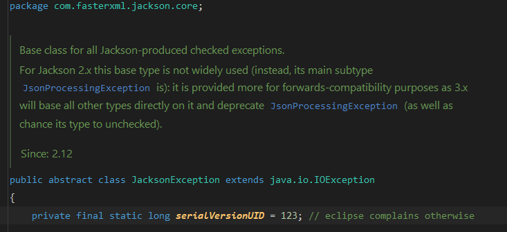
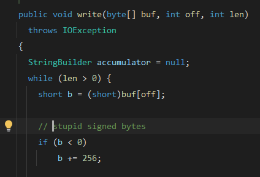
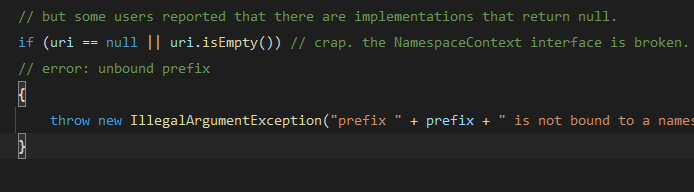
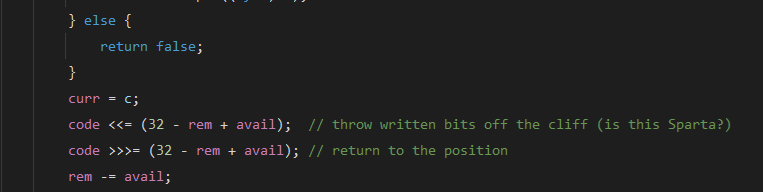
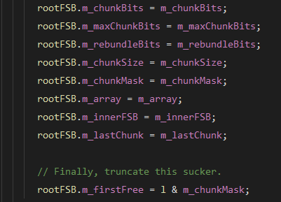
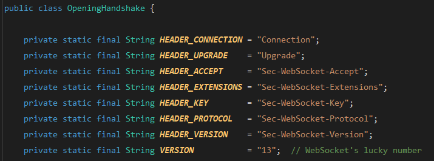
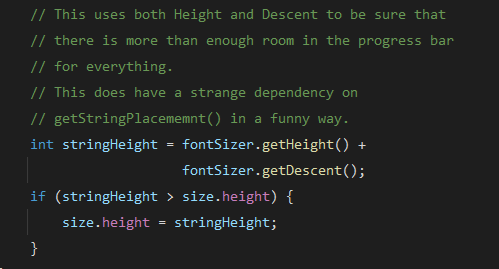
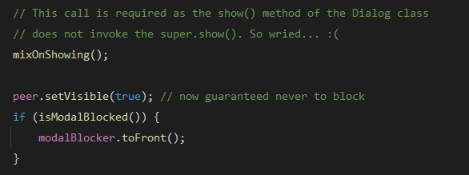
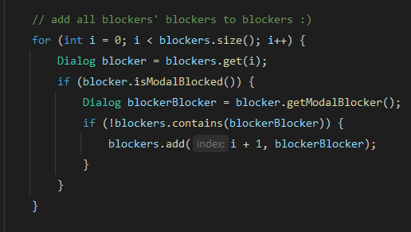

Here are some of the funniest comments I've discovered while "spelunking" through Java's source code: from the JDK itself to various libraries. These gems prove that even the most serious enterprise code can't suppress the human spirit (and occasional frustration) of its creators.

<!-- truncate -->

## Jackson Team Was Clearly Annoyed by Eclipse (But Not IntelliJ)

From `com.fasterxml.jackson.core.JacksonException` class, line 15:

When you extend `Exception` in Java, the compiler gently nudges you to define a `serialVersionUID` for serialization compatibility. It's actually sensible: Java wants to ensure classes can be safely serialized across different JVMs. But let's be brutally honest: when was the last time you serialized an `Exception` instance and sent it across the wire? Approximately never, right?

Still, tools like Eclipse will relentlessly nag you with warnings like "The serializable class lacks a serialVersionUID field." IntelliJ, being the cool kid, stays chill and lets you code in peace.

Picture this: the Jackson maintainers, busy building one of the world's most popular JSON libraries, getting constantly pestered by Eclipse's bureaucratic warnings. Their delightfully petty solution? Slap a `serialVersionUID` of `123` on their exception classes (like in `com.fasterxml.jackson.core.JsonProcessingException`). No complex hash, no auto-generated UUID: just a beautifully mundane `123`.

It's as if they said, "Fine, Eclipse, here's your precious ID: as vanilla as humanly possible!" A subtle middle finger to the bureaucracy of Java serialization, and a knowing wink to developers sharp enough to notice.

## That Byte Is Stupid

From `javax.swing.text.rtf.AbstractFilter` class, line 156:

As I noted in my [previous post](2025-07-16-java-heresies.md#unsigned-when), Java has exactly zero unsigned data types. The Swing team must have been pulling their hair out while wrestling with the limitations of the `byte` data type, which stubbornly ranges from `-128` to `127` instead of the far more sensible `0` to `255`.

Sometimes you just have to call a spade a spade: or in this case, call a frustratingly limited byte "stupid." Can't argue with that assessment, honestly.

## When URL Is Malformed... Somewhat

From `jakarta.xml.bind.DatatypeConverterImpl` class, line 401:

The Jakarta team was dealing with a classic case of "the spec says one thing, reality does another." The `NamespaceContext` interface contract clearly specifies that `getNamespaceURI` should never return `null`. Simple, right?

Wrong. Some implementations completely ignore this contract, forcing the Jakarta team to add this begrudging workaround. You can practically feel their exasperation seeping through the comment: they're essentially saying, "We know this shouldn't happen according to the rules, but here we are, coding defensively against people who can't read specifications."

It's the programming equivalent of putting up a "Wet Floor" sign for a floor that should never be wet in the first place.

## ~~This. Is. Sparta!~~

From `jdk.internal.net.http.hpack.NaiveHuffman` class, line 181:

I won't dive deep into ancient Sparta's rather grim traditions, but the `NaiveHuffman` comment about tossing bits "off the cliff (is this Sparta?)" is a brilliant nod to their notorious practice of, well, discarding what they deemed unfit.

This comment was written before the movie *300* turned "This is Sparta!" into a cultural phenomenon, making it an even more delightful piece of geek history. It's a wonderfully dramatic way to describe the mundane process of shifting out used bits in HPACK's bit-manipulation algorithm.

Though honestly, it would've been absolutely perfect with an image of King Leonidas dramatically kicking away the Persian messenger. Missed opportunity, JDK team!

## Yes, Truncate That Sucker!

From `com.sun.org.apache.xml.internal.utils.FastStringBuffer` class, line 381:

Yes, that "sucker" need to be truncated!

There's something refreshingly honest about this no-nonsense attitude. No euphemisms, no technical jargon: just pure, unadulterated determination to truncate that troublesome piece of data.

## "Lucky" WebSocket

From `jdk.internal.net.http.websocket.OpeningHandshake` class, line 80:

At first glance, you might assume the JDK team chose 13 as some kind of inside joke or random quirky number. Plot twist: it's actually the official WebSocket protocol version defined in [RFC 6455, section 4.1](https://datatracker.ietf.org/doc/html/rfc6455#section-4.1).

The "lucky number" comment is a delicious slice of irony: poking fun at 13's infamous reputation as the unluckiest number in many cultures, while acknowledging its absolutely critical role in WebSocket handshakes. It's not random at all; it's the precise version number that ensures your Java WebSocket client can communicate seamlessly with servers worldwide.

Just a little geeky wit from the JDK folks, proving that even the most standardized protocols can inspire a chuckle!

## Funny Progress Bar

From `javax.swing.plaf.basic.BasicProgressBarUI` class, line 916:

This comment highlights a beautifully convoluted design choice: `getPreferredSize()` carefully calculates the progress bar's dimensions (using font metrics) to ensure the progress string (like "42%") fits properly when positioned by `getStringPlacement()`: a method it doesn't even directly call.

This indirect dependency is what the JDK team diplomatically calls "funny": though "mildly infuriating" might be more accurate. It's like designing a door frame based on the measurements of a door you're not even installing yourself.

But wait, there's more! Sharp-eyed readers will notice the comment misspells the method as `getStringPlacememnt()` (spot the extra "m" and the swapped "n"). This typo in the comment (thankfully not in the actual code) is an accidental cherry on top, making the "funny way" even more endearingly human.

Sometimes the best humor is completely unintentional.

## The "Wierd" `:(` Sad Face

From `java.awt.Dialog` class, line 945:

Why the sad face?

The `Dialog.show()` method breaks convention by skipping the call to `super.show()` from its parent Window class. This forces developers to manually invoke `mixOnShowing()` to ensure the dialog actually appears correctly: a frustrating bit of extra choreography that shouldn't be necessary.

The JDK team's response? A rare `:(` emoji in their otherwise professional codebase. It's like finding a handwritten "ugh" in the margins of a textbook: a moment of genuine human exasperation breaking through the formal facade.

The cherry on top? `"Wried"` is a typo for "weird," making this comment doubly endearing. You can almost picture the developer, irritated by AWT's quirky design decisions, furiously typing and making a spelling error in their moment of annoyance.

A typo and a sad face: the perfect combo for anyone who's ever been stuck debugging AWT's peculiarities!

**Bonus round:** In the same class at line 1392, there's this absolute gem:

Modal dialogs are inherently tricky beasts: they block input to other windows, but what happens when a blocker is itself blocked?

The code dives headfirst into this recursive nightmare, tracking "blockers of blockers" in the complex web of dialogs that can prevent interaction with the current window. The tongue-twisting phrase "blockers' blockers to blockers" reads like a Dr. Seuss book written by computer scientists, but the `:)` smiley face absolutely steals the show!

It's as if the JDK developer, while untangling this Gordian knot of modal logic, decided to embrace the chaos with a cheerful grin: "Yep, we're deep in the recursive weeds here, and you know what? It's actually kind of fun!"

Finding a genuine smile in the typically stoic JDK codebase is like discovering a four-leaf clover: a delightful reminder that humans, not machines, crafted this digital labyrinth.

## More Adventures Await

Well, that should satisfy your appetite for code comedy: at least for Part 1! I'll keep excavating through source code repositories, hunting for more of these hidden treasures. There's an entire archaeological dig's worth of programmer personality buried in the depths of open-source libraries.

Until the next installment, happy coding!

**Remember:** Programming demands precision, accuracy, and ruthless efficiency. Yet behind every semicolon and curly brace, it's humans who breathe life into code. These humorous comments: tucked away like secret messages in bottles: reveal the very human touches of effort, creativity, and occasional existential frustration that shape the technology defining our digital world.

After all, we're not robots. At least, not yet.

Also, [part 2](2025-08-20-funny-java-comments-2.md) is now available!