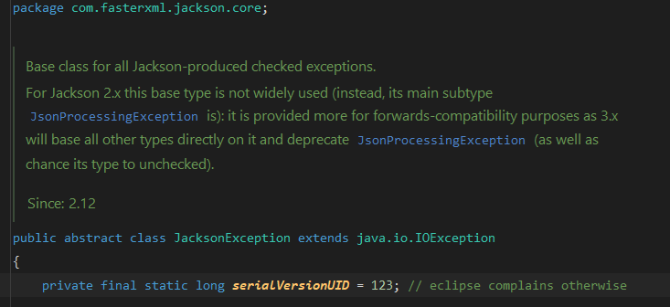
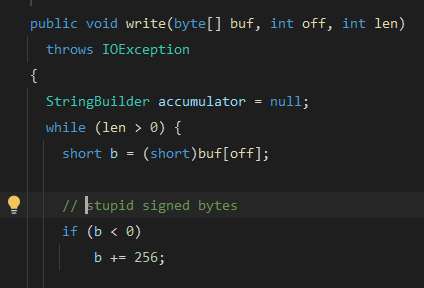
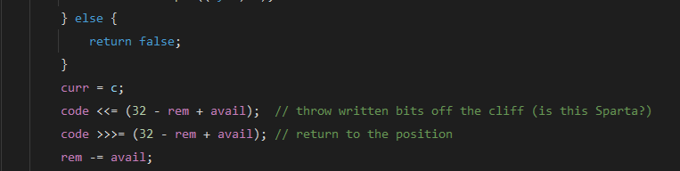
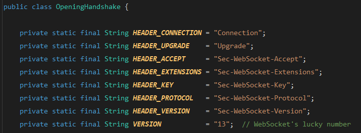

Here are some of the funny comments I found while skimming through Java's source codes from JDK and from some libraries as well.

<!-- truncate -->

## Jackson Team Clearly Was Annoyed by Eclipse (but not IntelliJ)

From `com.fasterxml.jackson.core.JacksonException`, line 15

When you extend `Exception` in Java, the compiler nudges you to define a `serialVersionUID` for serialization and deserialization. It makes sense: Java wants to ensure classes can be safely serialized across different JVMs. But let's be honest: how often do you serialize an `Exception` instance and send it across the wire? Almost never, right?

Still, tools like Eclipse will nag you with a warning, something like "lacks a serialVersionUID". IntelliJ, on the other hand, stays chill, letting you code in peace. Poor Jackson maintainers, likely wrestling with Eclipse's warnings while building their wildly popular JSON library. Their solution? Slap a `serialVersionUID` of `123` on their exception classes, like in `com.fasterxml.jackson.core.JsonProcessingException`. No complex hash, no auto-generated ID—just a delightfully "normal" 123. It's as if they said, “Fine, Eclipse, here's your ID, as plain as it gets!” A subtle jab at the bureaucracy of serialization, and a wink to developers who notice.

## That Byte Is Stupid

From `javax.swing.text.rtf.AbstractFilter`, line 156

As noted in my [post](2025-07-16-java-heresies.md#unsigned-when), there are no unsigned data type in Java. Swing team had to be very frustrated when dealing with limitation of byte data type, ranged from `-128` to `127`.

## When URL Is Malformed Somewhat

From `jakarta.xml.bind.DatatypeConverterImpl`, line 401

The Jakarta team was frustrated because the `NamespaceContext` interface contract specifies that `getNamespaceURI` should never return `null`, but some implementations don't honor this contract. This forced the team to add a frustrating workaround in the code to handle these non-compliant cases, ensuring robustness against such violations.

## ~~This. Is. Sparta!~~

From `jdk.internal.net.http.hpack.NaiveHuffman`, line 181

I won't dive too deep into ancient Sparta's grim traditions, but the `NaiveHuffman` comment about tossing bits "off the cliff (is this Sparta?)" is a cheeky nod to their ruthless practice of discarding the unfit.

Written before 300 made "This is Sparta!" iconic, it's a fun way to describe shifting out used bits in HPACK's bit-manipulation dance. Could have been better with the image of Leonidas kicking away the Persian messenger.

## Yes, Truncate that Sucker!

From `com.sun.org.apache.xml.internal.utils.FastStringBuffer`, line 381

Yes, that "sucker" need to be truncated!

Still, I think you will find something interesting if you check the source file by yourself.

## "Lucky" WebSocket

From `jdk.internal.net.http.websocket.OpeningHandshake`, line 80

At first glance, you might think the JDK team picked 13 as a random or quirky number, but it's actually the official WebSocket protocol version defined in [RFC 6455, section 4.1](https://datatracker.ietf.org/doc/html/rfc6455#section-4.1). The "lucky number" comment is a playful jab, poking fun at 13's notorious "unlucky" status in many cultures while nodding to its critical role in the WebSocket handshake. It's not random: it's the version that ensures your Java WebSocket client talks smoothly with servers worldwide. Just a bit of geeky wit from the JDK folks!

## Funny Progress Bar

From `javax.swing.plaf.basic.BasicProgressBarUI`, line 916

The comment points to a subtle design choice: `getPreferredSize()` calculates the progress bar's dimensions (using font metrics) to ensure the progress string (like "50%") fits when positioned by `getStringPlacement()`, a method it doesn't directly call. This indirect dependency is what the JDK team calls "funny", adding a dash of geek humor to Swing's complex UI logic.

But wait, there's more!

The comment misspells the method as `getStringPlacememnt()` (note the extra "m" and swapped "n"). This typo in the comment (not the code) is an unintentional chuckle, making the "funny way" even more amusing for sharp-eyed developers!

## The "Wierd" `:(` Sad Face

From `java.awt.Dialog`, line 945

Why the sad face? 

The `Dialog.show()` method skips calling `super.show()` from its parent Window class, forcing developers to manually invoke `mixOnShowing()` to ensure the dialog displays correctly. The JDK team vents their annoyance with a rare `:(` emoji: a playful cry of exasperation in the otherwise stoic JDK codebase.

And `"wried"`? That's a typo for "weird", making the comment doubly amusing. It's as if the developer, in a moment of irritation, mistyped while grumbling about this quirky design. A typo and a sad face: what a relatable combo for any coder stuck debugging AWT's peculiarities!

Bonus: in the same class, line 1392, there is this gem:

Modal dialogs are tricky: they block input to other windows, but what if a blocker is itself blocked?

The code dives into this nested mess, adding "blockers of blockers" to the list of dialogs that prevent interaction with the current one. The tongue-twisting phrase "blockers' blockers to blockers" is already a chuckle-worthy nod to AWT's complex window hierarchy, but the `:)` smiley face steals the show!

It's as if the JDK developer, wrestling with this recursive logic, decided to grin and bear it, tossing in a playful emoji to say, "Yup, we're untangling this knot, and it's kind of fun!" A rare smile in the serious JDK codebase, it's a wink to anyone brave enough to navigate AWT's modal maze.

## More Is Coming?

Well, that should be enough for this first part. I will keep digging through the source codes and post here if I find anything funny. Until then, so long!

Remember: Programming demands precision, accuracy, and efficiency. Yet, behind the scenes, it's humans who bring code to life. Humorous comments tucked away in the source code of libraries reveal the human touch: effort, creativity, and occasional frustration, that shapes the technology defining our world.