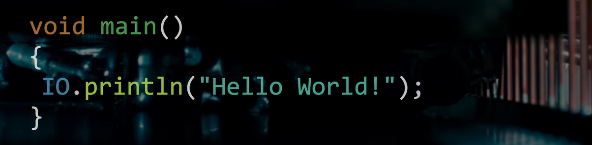

import YoutubePlayer from '@site/src/components/YoutubePlayer/YoutubePlayer';

Java's getting a makeover, and honestly, it's about time. Let's see how the JDK is slowly but surely making Java less intimidating for folks who just want to print "Hello, World!" without summoning the ancient spirits of enterprise development.

<!-- truncate -->



## The Ancient Dark Arts (Pre-JDK 7)

But before we dive into the main event, let's take a moment to appreciate some truly cursed Java history. Back in the stone age (pre-Java 7), there was an even more sinister way to print "Hello, World!" that would make modern developers weep:

```java
class TheStatic {
    
  static {
    System.out.println("Hello, World!");
  }
}
```

That's it. No main method, no nothing. Just a static initialization block sitting there like some kind of programming demon summoning ritual. You could literally print `Hello, World!` just by loading the class, not even running it properly! It was like Java's equivalent of a haunted house: just walking through the door was enough to trigger the ghosts.

Of course, your program wouldn't manage to run properly by using this dark magic, but hey, at least you got your greeting out! Thankfully, the Java gods put an end to this madness in JDK 7, so no more confusing shenanigan!

Things could have always been worse. At least `public static void main(String[] args)` actually makes some sense compared to... whatever that was.

~~(Yes, it broke the styling of my blog because I enforced the code block to be inline)~~

## The "public static void main string args" Ritual of Doom

~~(I have to not use the tilde characters to wrap the public static void main string args because it is too long)~~

Ah yes, the legendary Java incantation that has traumatized countless programming newbies since the dawn of time:

```java
class Main {
    
  public static void main(String[] args) {
    System.out.println("Hello, World!");
  }
}
```

Look at this beautiful disaster! Want to print a simple greeting? Sure, but first you must appease the Java gods with this 47-character ceremonial chant. It's like needing a PhD in ancient linguistics just to say "hi" to your computer.

Take a look at this beautiful code from Python:

```python
print("Hello, World!")
```

For someone who just wants to dip their toes into programming, this verbal nonsense is about as welcoming as a calculus textbook written in moonrunes. You're trying to learn basic concepts, but Java's over here like:

> ***FIRST, YOU MUST UNDERSTAND THE SACRED MYSTERIES OF ACCESS MODIFIERS AND METHOD SIGNATURES!***

If you are a beginner but curious? Expand the below section.

<details>

<summary>What's actually happening in this mess?</summary>

Buckle up, because we're about to decode this ancient prophecy:

* `class`: Welcome to Java's obsession with object-oriented programming! Everything must live inside a class. Want to add `2+2`? Better make a class for it. It's classes all the way down, baby.

* `public`: This is Java saying "Hey everyone, come look at my method!" It's the programming equivalent of shouting in a library. Other classes can access this stuff, which is great when you actually have other classes (spoiler: you don't, you just want to print something. But you need `public` access modifier so that JVM can detect your program's entry point.

* `static`: The "no assembly required" keyword. This means the method belongs to the class itself, not to any particular instance of it. Think of it as the class's personal method that does not need you to create an object first. Very convenient, very confusing for beginners.

* `void`: The method's way of saying "I'm not giving you anything back, deal with it" (read: a method that returns nothing). It's like asking someone for directions, and they just grunt and walk away.

* `main`: The chosen one! Java looks specifically for this name when you hit run. Call it maine, mane, or bob and Java will just give you a simple nope and walk away nonchalantly.

* `String[] args`: The phantom parameter that 99% of beginner programs completely ignore. It's for command-line arguments, which is fancy talk for "stuff you type after the program name."

Want to pass arguments like this?

```shell
java Main "I love Java" "Just kidding"
```

Then `args[0]` would be `I love Java` and `args[1]` would be `Just kidding`. But let's be real: you're probably not going to touch this for months, so it just sits there, taking up space like that exercise bike in your bedroom.

Even more advanced enterprise-grade projects rarely make use of this "feature", so you can rest assured that you won't need to know what it is for now.

Finally, what's `System.out.println` anyway? Think of it as Java's unnecessarily complicated way of talking to your screen. `System` is a class for accessing system resources, `out` is a `PrintStream` object (trust me, you don't need to understand that right now), and `println` is the only part that matters: it prints your text. Why make beginners wrestle with this three-headed monster just to say `Hello, World!`? It's programming hazing, basically.

</details>

Starting from JDK 21, Project Amber promises a "solution" to this torture!

## The First Baby Step: [JEP 445](https://openjdk.org/jeps/445)

Behold! **JEP 445** has blessed us with this revolutionary concept:

```java
void main() {
  System.out.println("Hello, World!");
}
```

Look at that beauty! No more `class` declaration cluttering up the place, no more `public static` doing whatever mysterious things they do, and (praise the coding gods) no more `String[] args` sitting there like an unwanted dinner guest. Just a clean, simple `void main()` that actually makes sense to human beings.

:::note

This is a preview feature, which is Java's way of saying "We're 90% sure this won't break your computer, but no promises!".

You'll need to add `--enable-preview` to your JVM arguments to try it out.

Some IDEs may support the option to enable the preview features via graphical interface if you don't want to be bothered with manually inputting the parameters.

:::

It's giving me serious "Apple finally adding a feature that Android had 5 years ago" vibes, but hey, progress is progress! Sometimes the best innovations are just removing the unnecessary crud that nobody asked for in the first place.

And don't worry, all your favorite Java verbosity is still available if you're into that sort of thing. You can still add your `class` declaration, throw in those `String[] args` if you're feeling nostalgic, or stick with the classic `public static void main(String[] args)` if you enjoy the pain. JEP 445 is like having a "simple mode": it's there when you need it, but all the complicated stuff is still lurking in the background, waiting for when you're ready to embrace the chaos.

:::tip

One beautiful thing about this change: with the old main method approach, adding any helper functions meant decorating everything with the `static` modifier and diving into the wonderful world of "what's the difference between static and instance members?" Talk about adding another layer of complexity to your spell book! Why write simple functions when you can first master Java's philosophical treatise on object identity?

:::

## Under the Hood Shenanigans: [JEP 463](https://openjdk.org/jeps/463)

JDK 22 rolled up with **JEP 463**, which is basically Java's version of "we didn't change the interface, but we totally rewrote the engine". No shiny new syntax to get excited about, but plenty of behind-the-scenes drama happening in the "which main method should we actually run?" department.

Plot twist: when push comes to shove, the ancient `public static void main(String[] args)` still gets VIP treatment and wins the battle royale. It's like having a fancy new sports car that still gives right-of-way to your grandpa's 1987 Honda Civic. ~~Respect your elders, kids!~~

Want the juicy technical details? Click that link up there and dive into the JEP document. Fair warning: it's about as thrilling as reading the phone book, but hey, some people are into that.

:::note

Surprise! Still rocking that preview status. Our beloved `--enable-preview` flag continues its victory lap!

:::

## The Retirement of a Tyrant: [JEP 477](https://openjdk.org/jeps/477)

JDK 23 just delivered the knockout punch we've all been waiting for! **JEP 477** finally put `System.out.println` out of its misery:

```java
void main() {
  println("Hello, World!");
}
```

*Wipes away a single tear* 🥲

Look at that gorgeous simplicity! The `println` method now comes from a fancy new class called `java.io.IO` that gets automatically imported into every "simple" program. No more ceremonial chanting, no more three-part harmony of confusion, just good old-fashioned `println` like civilized programming languages have been doing since the dawn of time.

And yes, before you ask: this is giving major Python vibes, and people are absolutely losing their minds about it. "Java looks like a real programming language now!" they cry. "It's just like Dart's Hello World!" they exclaim. After decades of verbose solidarity, Java has finally joined the "normal syntax" club. It's like watching your stubbornly formal grandfather finally learn to text with emojis.

But wait, there's more! This JEP doesn't just stop at `println`, oh no. it's going full nom-nom on your imports. Everything from the `java.base` module is now magically available without those tedious `import` statements. Want to use `List`? It's there. `Set`? Ready to go. `Stream`? Come on down!

It's like having a programming buffet where all the good stuff is already on your plate. No more hunting through documentation to figure out which package your favorite class lives in.

Java's finally learned that life's too short for manual imports.

:::note

Still a preview feature. Don't forget your `--enable-preview` flag!

:::

## The Polish Job: [JEP 495](https://openjdk.org/jeps/495)

JDK 24 shows up fashionably late with **JEP 495**, which is basically the "fine-tuning" update. Oh, and there's also some shiny new Stream Gatherers ([JEP 485](https://openjdk.org/jeps/485)) that graduated from preview to full-time employment. Definitely worth a peek!

**JEP 495** is like **JEP 477**'s perfectionist younger sibling. Same energy, but with that obsessive attention to detail that makes everything *just right*. The big win? Unicode character support finally got the memo!

Remember when you'd try to print your beautifully exotic name like `José` or `François` and Java would just throw up its hands and give you `Jos?` or `Fran?ois` like some kind of digital hiccup? Those days are officially over!

Now `println` speaks the same Unicode language as `System.out.println`, which means no more question mark confetti when you're trying to display anything fancier than basic English. Your name, your hometown, your favorite emoji -- they all get the VIP treatment they deserve.

It's like Java finally learned that not everyone lives in ASCII-ville. About time! Now your glorious multicultural identity can be properly displayed without looking like your keyboard had a seizure.

Again, don't forget your `--enable-preview` flag!

## The Victory Lap: [JEP 512](https://openjdk.org/jeps/512)

After 25 versions of Java across 30 glorious years, and 4 JEPs worth of digital therapy, we've finally reached the promised land! **JEP 512** (dropping in September 2025) is here to put the cherry on top of this beautiful transformation:

```java
void main() {
    IO.println("Hello, World!");
}
```

And yes, 512 = 2<sup>9</sup> for all you binary nerds out there. Very satisfying! Though rumor has it that they are saving JEP 1024 for something truly spectacular (maybe the day Java learns to read our minds or so).

So what changed from the previous episodes of this makeover show? The `println` method packed up and moved from `java.io.IO` to the fancier `java.lang.IO` neighborhood. 

And as we all know, everything in `java.lang` gets the VIP "no import required" treatment. It's like having a backstage pass to Java's inner circle. Therefore, we can use the `IO` class directly and invoke its methods without importing.

But wait, there's more! [JEP 511](https://openjdk.org/jeps/511) gives EVERYONE access to `java.base` goodies: "You get automatic imports! And you get automatic imports! EVERYBODY gets automatic imports!"

And `println` didn't come alone to this party. It brought friends:

* `print()` for when you want to print without that pesky newline (goodbye, `System.out.print`!)

* `readln()` which is basically Java saying "Remember that `Scanner` nightmare with `nextLine()` and `nextInt()` and wanting to throw your laptop out the window? Yeah, we're sorry about that. Here's a method that actually makes sense."

For beginners and grizzled Java veterans alike, this feels like waking up from a 30-year fever dream where simple things required PhD-level incantations. Java's finally learned that sometimes, less really is more. Took three decades to figure that out!

And yes, this will be a final feature, which means no more `--enable-preview`. Cheers!

## A Mild Complaint

Don't get me wrong – I'm thrilled that Java finally decided to join the "simple syntax" party. But there's something deliciously frustrating about this whole evolution that I can't shake off.

Here's the thing that'll make you want to bang your head against your keyboard: take a peek at the source code of that shiny new `java.lang.IO` class that's supposedly revolutionizing Java development:

<details>

```java
public final class IO {

  // Other methods

  public static void println(Object obj) {
    System.out.println(obj); // Wait... what?
  }

  public static void print(Object obj) {
    var out = System.out;
    out.print(obj);
    out.flush();
  }

  public static String readln(String prompt) {
    print(prompt);
    return readln();
  }

  private static BufferedReader br;

  static synchronized BufferedReader reader() {
    if (br == null) {
      String enc = System.getProperty("stdin.encoding", "");
      Charset cs = Charset.forName(enc, StandardCharsets.UTF_8);
      br = new BufferedReader(new InputStreamReader(System.in, cs));
    }
    return br;
  }
}

```

</details>

That's it. That's literally it. We've been doing ceremonial dances around `System.out.println` for three decades, and the "revolutionary" solution is... a wrapper method that calls `System.out.println` internally.

This isn't rocket science. This isn't some breakthrough in computer science that required years of research. This is literally 20 lines of wrapper code that any junior developer could have written during their lunch break in 1995. Yet here we are in 2025, celebrating it like we've just invented the wheel.

It's like discovering that the cure for your daily headache was always just taking an aspirin, but everyone insisted on performing elaborate rituals with crystals and ancient chants for thirty years instead.

So yes, I'm mildly complaining about the timing, but I'm also celebrating the outcome. Java is finally growing up, and it's better late than never!

## Bonus Round: Even Spring Boot Gets a Makeover!

To lighten the mood, I have a bonus for you:

Remember Spring Boot applications with their intimidating startup ceremonies? Well, they now can make use of this simplification treatment too:

<details>

```java
import org.springframework.boot.SpringApplication;
import org.springframework.boot.autoconfigure.SpringBootApplication;

// Spring Boot app still needs a class to be annotated
// with @SpringBootApplication
// It still needs String[] args for additional command line arguments
@SpringBootApplication
class SpringBootMain {
    
  void main(String[] args) {
    SpringApplication.run(getClass(), args);
  }
}
```

</details>

Look at that! No more `public static` everywhere. Sure, Spring Boot still needs its `@SpringBootApplication` annotation and some others (some things never change), and you'll still want those `String[] args` for command-line shenanigans, but hey, progress is progress! Even enterprise Java is learning to chill out a little.

## The End of an Era

~~*And the Beginning of a Better One*~~

We've gone from this medieval incantation:

```java
public class HelloWorld {
  public static void main(String[] args) {
    System.out.println("Hello, World!");
  }
}
```

To this beautiful simplicity:

```java
void main() {
  IO.println("Hello, World!");
}
```

It's like Java finally looked in the mirror and realized it had been wearing a tuxedo to go grocery shopping for three decades. Sometimes the best innovation isn't adding more features: it's having the courage to ~~throw out~~ store away the unnecessary baggage.

For beginners, this means you can actually focus on learning programming concepts instead of memorizing magic spells. For veterans, this means you can finally stop explaining why Java needs 548 keywords just to print "Hello" (though let's be honest, you'll probably miss complaining about it).

Java's growing up, learning to be more approachable while keeping all the enterprise-grade power that made it famous. It's like your favorite coffee shop finally figured out how to make ordering a simple latte less complicated than filing your taxes.

As a bonus, please watch this video:

<details>

<summary>Finalizing the Java On-ramp - Inside Java Newscast #90</summary>

<YoutubePlayer videoId="4WjXTe_FKO4"></YoutubePlayer>

</details>

## References

* [JEP 445: Unnamed Classes and Instance Main Methods (Preview)](https://openjdk.org/jeps/445)

* [JEP 463: Implicitly Declared Classes and Instance Main Methods (Second Preview)](https://openjdk.org/jeps/463)

* [JEP 477: Implicitly Declared Classes and Instance Main Methods (Third Preview)](https://openjdk.org/jeps/477)

* [JEP 495: Simple Source Files and Instance Main Methods (Fourth Preview)](https://openjdk.org/jeps/495)

* [JEP 512: Compact Source Files and Instance Main Methods](https://openjdk.org/jeps/512)

* [JEP 511: Module Import Declarations](https://openjdk.org/jeps/511)