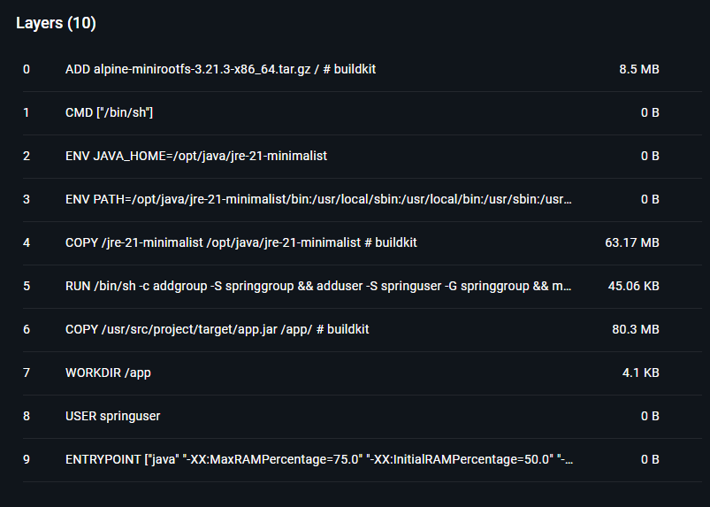

Today we're going on a container diet journey that'll make your Spring Boot apps leaner than the bloated things you often see during your Docker builds.

<!-- truncate -->

## TL;DR

Alright, alright! I see you scrolling down looking for the goods. Here's the complete `Dockerfile` that'll make your containers skinnier than a supermodel on a juice cleanse:

<details>

```dockerfile
#
# Multi-stage Dockerfile for Java Spring Boot application
#

# Stage 1: Build stage - Where the magic happens
FROM eclipse-temurin:21-jdk-alpine AS build
WORKDIR /usr/src/project

# Copy Maven files first because we're smart like that
# (Docker cache is your best friend, treat it right)
COPY pom.xml mvnw ./
COPY .mvn/ .mvn/
RUN chmod +x mvnw

# Download dependencies - this is usually the longest stage
# Trust me, without caching this step, you'll age visibly
RUN ./mvnw dependency:go-offline

# Now for the actual source code (the star of the show!)
COPY src/ src/

# Build the thing! Skip tests because YOLO production deployment
# (Just kidding, run your tests in CI/CD like a responsible adult)
RUN ./mvnw clean package -DskipTests

# Time for some JAR surgery
RUN jar xf target/app.jar

# Let jdeps be the detective and figure out what we actually need
RUN jdeps  \
    --ignore-missing-deps  \
    -q --recursive  \
    --multi-release 21 \
    --print-module-deps  \
    --class-path 'BOOT-INF/lib/*' \
    target/app.jar > deps.info

# Create the minimalist JRE
# jdk.crypto.ec is for HTTPS, otherwise ignore it
RUN jlink \
    --add-modules $(cat deps.info),jdk.crypto.ec \
    --strip-debug  \
    --compress 2  \
    --no-header-files  \
    --no-man-pages \
    --output /jre-21-minimalist

# Stage 2: The lean, mean, production machine
FROM alpine:3.21.3 AS final

# Set up our custom Java home
ENV JAVA_HOME=/opt/java/jre-21-minimalist
ENV PATH=$JAVA_HOME/bin:$PATH

# Move in our custom-built JRE
COPY --from=build /jre-21-minimalist $JAVA_HOME

# Security 101: Don't run as root
RUN addgroup -S springgroup \
    && adduser -S springuser -G springgroup \
    && mkdir -p /app \
    && chown -R springuser:springgroup /app

# Bring over our precious application
COPY --from=build /usr/src/project/target/app.jar /app/

WORKDIR /app
USER springuser

#
# Launch sequence initiated! 🚀
#

# These JVM flags are like performance vitamins for your container:
# - MaxRAMPercentage: Don't be greedy, use 75% max
# - InitialRAMPercentage: Start with 50% like a reasonable person
# - MaxMetaspaceSize: Uncontrollable growing is cancer, in form of a deadly OutOfMemoryError
# - UseG1GC: Because G1 is the cool garbage collector, fine tune it for your actual usage
#
# Add other parameters to tailor to your project's needs
ENTRYPOINT ["java", "-XX:MaxRAMPercentage=75.0", "-XX:InitialRAMPercentage=50.0", "-XX:MaxMetaspaceSize=512m", "-XX:+UseG1GC", "-jar", "app.jar"]
```

</details>

Still with me? Cool! Let's break this bad boy down and see what's happening under the hood.

## The THICC Problem with Default Java Images

Look, we need to talk about your Docker images. They're... how do I put this gently? 

Absolutely ***THICC***. Like, "takes-up-half-your-hard-drive" thicc. But don't worry!


~~Extra THICC indeed, Mr. Aku.~~

You may be using `eclipse-temurin:21-jdk` and wondering why your "simple" Spring Boot app is pushing 300+ MB? Well, congratulations! You've just packed the entire Java kitchen sink into your container. Your app probably uses like 10% of what's in there, but Java's all "*here, take ALL the modules, you might need them someday!*"

(spoiler: most of the time, you might not)

## Custom JRE with `jlink`

Java 9 gave us some pretty neat tools called `jdeps` (the nosy neighbor who knows exactly what your app is using) and `jlink` (the minimalist guru who helps you throw away everything you don't need).

:::info[PSA for the JDK 8 holdouts]

Sorry folks, this party is JDK 9+ only! If you're still on JDK 8, maybe it's time to have that awkward conversation with your tech lead about upgrading to JDK 17. I know, I know. They'll probably give you the classic "no resources, no time, no budget" triple threat. But hey, at least you tried!

:::

## Multi-Stage Dockerfile Breakdown

### Stage 1: Build and Analysis

```dockerfile
FROM eclipse-temurin:21-jdk-alpine AS build
WORKDIR /usr/src/project

COPY pom.xml mvnw ./
COPY .mvn/ .mvn/
RUN chmod +x mvnw

RUN ./mvnw dependency:go-offline

COPY src/ src/

RUN ./mvnw clean package -DskipTests
```

We're copying the Maven files first because Docker layer caching is basically magic. If your `pom.xml` doesn't change, Docker will "remember" this and use the cache to speed up the build process. Thank the almighty Docker Gods!

> If your project does not have Maven wrapper (`.mvnw` folder and `mvnw` file), you can visit [here](https://start.spring.io/) to get your own

Still, consult with your DevOps engineers and ask them if caching is viable (and also about the option to purge the cache in case of caching problems).

:::tip[Fun Fact]

During the build stage, you can spam `RUN` commands like you're texting your crush. Since these layers won't make it to the final image, go wild! Your future debugging self will appreciate the granular steps. It helps with caching too!

:::

#### Playing with `jdeps`

```dockerfile
RUN jar xf target/app.jar

RUN jdeps  \
    --ignore-missing-deps  \
    -q --recursive  \
    --multi-release 21 \
    --print-module-deps  \
    --class-path 'BOOT-INF/lib/*' \
    target/app.jar > deps.info

# Debug: Let's see what this sneaky tool found
RUN echo "Required Java modules:" && cat deps.info
```

`jdeps` is basically telling you what modules you are actually using since 2019. The `--ignore-missing-deps` flag is crucial because sometimes dependencies are like "hey, I reference this class" but it's nowhere to be found.

:::tip[Pro Developer Move]

I added that console log so you can see what modules `jdeps` thinks you need. You could even copy-paste this list and hardcode it for *slightly* faster builds.

Is the performance gain worth it? Probably not. Will it make you feel like an optimization hack? Absolutely!

:::

#### `jlink`, the Minimalist Guru

```dockerfile
RUN jlink \
    --add-modules $(cat deps.info),jdk.crypto.ec \
    --strip-debug  \
    --compress 2  \
    --no-header-files  \
    --no-man-pages \
    --output /jre-21-minimalist
```

`jlink` is where the magic happens! It's like having a personal trainer for your JRE: no fluff, no unnecessary bulk, just pure, lean runtime goodness. We're manually adding `jdk.crypto.ec` because `jdeps` sometimes doesn't realize that HTTPS exists, and in the sample project, we need HTTPS support.

### Stage 2: The Lean Production Machine

```dockerfile
FROM alpine:3.21.3 AS final

ENV JAVA_HOME=/opt/java/jre-21-minimalist
ENV PATH=$JAVA_HOME/bin:$PATH

COPY --from=build /jre-21-minimalist $JAVA_HOME
```

#### The Great libc Compatibility Drama

:::warning

Here's where things get spicy. You CANNOT mix and match your build and runtime environments like you're at a salad bar! Both stages need to be Alpine-compatible, or you'll get the dreaded "No such file or directory" error that will haunt your dreams.

The villain of this story? **libc compatibility**:

- **glibc**: The popular kid (Ubuntu, CentOS, RHEL, Debian)
- **musl libc**: The cool alternative kid (Alpine Linux)

These two are like oil and water: they just don't mix! If you build on glibc and run on musl (or vice versa), your container will throw a tantrum like a toddler denied candy.

:::

This is why we use `eclipse-temurin:21-jdk-alpine` for building. We're keeping everything in the Alpine family. It's like a very exclusive club, but for libraries. Again, `alpine` is what makes our reduced image size successful!

#### Security Theater

```dockerfile
RUN addgroup -S springgroup \
    && adduser -S springuser -G springgroup \
    && mkdir -p /app \
    && chown -R springuser:springgroup /app

COPY --from=build /usr/src/project/target/app.jar /app/
WORKDIR /app
USER springuser
```

Running as `root` is like leaving your front door open with a sign that says "Free Stuff, Please Take".

Don't be that person. Create a nice, boring user account that can't accidentally nuke your entire system.

#### JVM Tuning

```dockerfile
ENTRYPOINT ["java", "-XX:MaxRAMPercentage=75.0", "-XX:InitialRAMPercentage=50.0", "-XX:MaxMetaspaceSize=512m", "-XX:+UseG1GC", "-jar", "app.jar"]
```

These JVM flags are like seasoning for your container, and the right amount makes everything better:

- `MaxRAMPercentage=75.0`: "Hey Java, don't be a memory hog"
- `InitialRAMPercentage=50.0`: "Start reasonable, scale as needed"
- `MaxMetaspaceSize=512m`: "Metaspace, you have a budget. Stick to it!"
- `UseG1GC`: "Use the fancy garbage collector that makes things go zoom"

## The Results

This approach typically shrinks your images by 60-80%! That's like going from an SUV to a smart car – same functionality, way less bulk, and your wallet will thank you when those storage bills come in.

As you can see, the image size is around 150 MB, compared to what might have been 400-500 MB initially with "naive" full JDK inclusion method.



## Wanna Try This Magic for Yourself?

I've got you covered! Check out the complete working example at [my sample repository](https://github.com/vulinh64/spring-base). Just run the `run-docker.cmd` file and watch the automation magic happen!

:::note

That script is Windows-only because I'm a Windows person ~~(don't @ me)~~. Need it for Linux or Mac? Just copy-paste it into Claude AI and ask Sonnet to translate it. It's like Google Translate, but for shell scripts!

:::

## The Bottom Line

Creating custom JREs with `jlink` is like learning to cook instead of ordering takeout every night – it takes a bit more effort upfront, but the long-term benefits are totally worth it. Your images will be smaller, your deployments faster, and your security posture stronger.

Just remember the golden rules:

1. Keep your build and runtime environments compatible (Team Alpine all the way!)

2. Test everything thoroughly (because nobody likes surprises in production)

3. Don't trust `jdeps` completely – sometimes you need to manually add modules

Now go forth and create some beautifully slim Docker images! Your infrastructure team will probably send you a thank-you card. Or at least stop giving you dirty looks during deployment time.

You can also go back [here](#tldr) and copy/paste as you like, after making such a tedious trip to the end of this article.

## 📒 See Also

* [Using JLink to create smaller Docker images for your Spring Boot Java application - dev.to](https://dev.to/snyk/using-jlink-to-create-smaller-docker-images-for-your-spring-boot-java-application-3m99?comments_sort=latest)