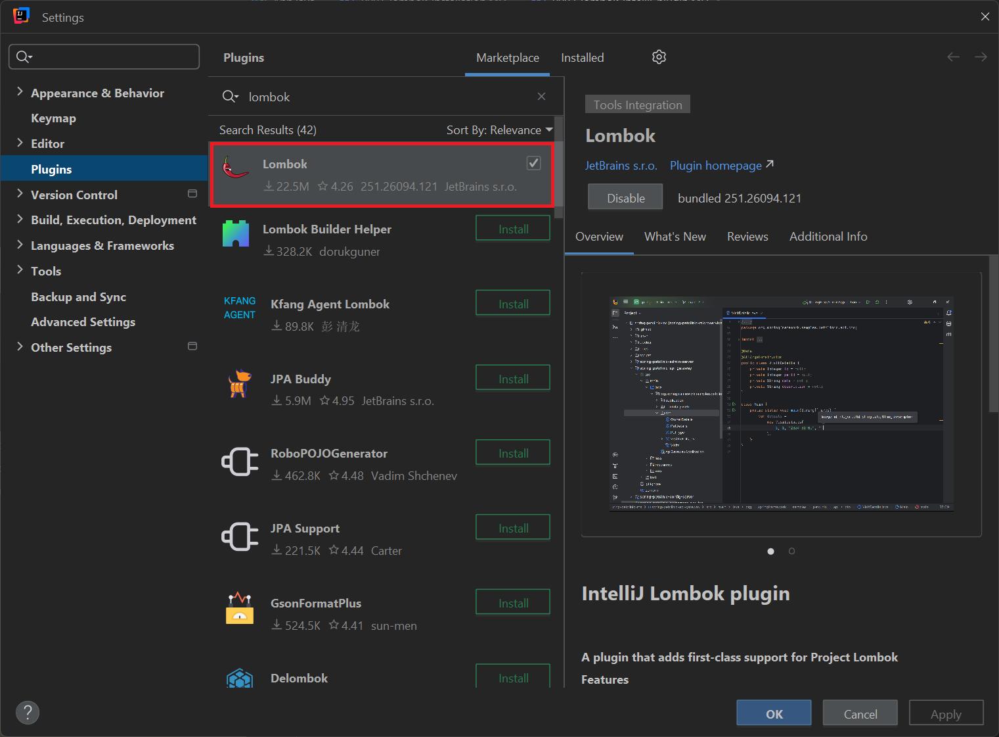
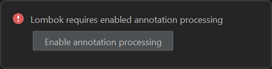

import GoBackToTldrButton from '@site/src/components/GoBackToTldrButton';

The usage of Project Lombok's different annotations for specialized use cases (and how to avoid becoming the person everyone blames when the build breaks).

<!-- truncate -->

## TL;DR

Here is the list of the tricks we can use to maximize the potential of Lombok:

<details>

* [Basic JPA entities](#basic-jpa-entities)

* [Using DTOs](#powering-up-your-dtos)

* [With Java Records](#java-records)

* [Without Java Records](#before-java-records-in-jdk-14-the-dark-ages)

* [Use `@SneakyThrows`](#the-sneaky-sneakythrows-the-exception-ninja)

* [The `@RequiredArgsConstructor` underrated hero](#the-underrated-requiredargsconstructor-the-unsung-hero-of-dependency-injection)

* [The `@Locked` over `@Synchronized` battle](#the-cool-kid-locked-over-big-boss-synchronized)

* [The Intricate of `@Getter`](#the-better-getter-way-to-trick-the-compiler-the-art-of-interface-deception)

</details>

## Installation

~~Or: How to Convince Maven You're Not Crazy!~~

You can skip this section if your project already has proper Lombok configuration. If not, buckle up, because we're about to dive into dependency hell together.

Click [here](#basic-jpa-entities) to start exploring.

### Step 1: Transitive Dependency (The Easy Part, Surprisingly)

<details>

Add the following dependency to your project's `pom.xml` file, and pray to the Maven gods:

```xml
<dependency>
    <groupId>org.projectlombok</groupId>
    <artifactId>lombok</artifactId>
    <version>${lombok.version}</version>
</dependency>
```

The property `lombok.version` is mostly defined by the Spring Boot parent POM, but you can also define the value manually if you enjoy living dangerously.

The latest version at the time of this writing is `1.18.38`. By the time you read this, it's probably outdated, so check regularly!

You can find the latest version of Lombok [here](https://mvnrepository.com/artifact/org.projectlombok/lombok).

</details>

### Step 2: Annotation Processing Configuration

<details>

You will also need to configure annotation processors if your project falls under any of the following scenarios:

* Your project is using JDK 23 or later (JDK 25 is expected to become the new standard upon its release in September 2025). ~~Congratulations, you're living in the future! Now suffer the consequences.~~

* Your project uses JDK 9 or above and incorporates the Java Module System (i.e., contains a `module-info.java` file). This is a relatively uncommon setup in most projects, which means you're either very brave or very unlucky.

* Your project includes additional annotation processors such as MapStruct, QueryDSL, Hibernate ModelGen, or others. In these cases, proper configuration ensures all processors function correctly and do not engage in epic battles that crash your build.

Add the following configuration to the `maven-compiler-plugin` plugin:

```xml
<annotationProcessorPaths>
    <path>
        <groupId>org.projectlombok</groupId>
        <artifactId>lombok</artifactId>
        <version>${lombok.version}</version>
    </path>

    <!-- Other annotation processors (may they play nicely together) -->
</annotationProcessorPaths>
```

So the full `maven-compiler-plugin` declaration will look like this:

```xml
<build>
    <plugins>
        <!-- Other plugins -->
        <plugin>
            <groupId>org.apache.maven.plugins</groupId>
            <artifactId>maven-compiler-plugin</artifactId>
            <version>${maven-compiler-plugin.version}</version>
            <configuration>
                <source>${java.version}</source>
                <target>${java.version}</target>
                <annotationProcessorPaths>
                    <path>
                        <groupId>org.projectlombok</groupId>
                        <artifactId>lombok</artifactId>
                        <version>${lombok.version}</version>
                    </path>

                    <!-- Other annotation processors (hopefully not enemies) -->
                </annotationProcessorPaths>
            </configuration>
        </plugin>
    </plugins>
</build>
```

In this example:

* `java.version` = `21` (because we're optimistic about the future)
* `maven-compiler-plugin.version` = `3.14.0` (`PI` reference intended for maximum nerd points)

</details>

### Step 3: IntelliJ IDE Integration

IntelliJ is often smart enough to give you the recommendation, but if not, then expand the section below:

<details>

#### Install Lombok Plugin

You need to check if the Lombok plugin is already installed on your IntelliJ IDE like the picture below. If it's not there, prepare for some quality time with plugin management:



> You can manually download the plugin from [here](https://plugins.jetbrains.com/plugin/6317-lombok) if you enjoy doing things the ~~hard~~ manual way.

#### Enable Annotation Processing When Running

When running the application in your local environment, click `Enable annotation processing` when prompted, like below. This is your IDE basically saying "*I am nice like this, I urge you to turn this on!*":



#### Final Check (The Prayer Circle)

Finally, do a clean Maven build to verify if your project can compile successfully, or if it will explode spectacularly:

```shell
mvn clean install -DskipTests
```

`-DskipTests` can be specified (or not) if you do not need to run the unit tests for the time being. Some might call this "living life on the edge."

You can also test the application by building the Docker image (if possible) to see if your project will work in a containerized environment.

</details>

## Some Rules of Thumb Before Diving Into Lombok

You can freely skip this part and jump straight to the direct use cases if you enjoy learning through ~~pain and suffering~~ trial and error. For everyone else, these rules have already been incorporated into the examples below.

Click [here](#basic-jpa-entities) to start exploring.

### You Can Safely Use Lombok Annotations Inside the `lombok` Package (The Good Ones)

<details>

Some of them that I recommend using without fear of immediate career termination are:

* `@Getter` (because typing getters is what nightmares are made of)

* `@Setter` (ditto, but for setters)

* `@Data` (the nuclear option for when you want everything)

* `@Value` (not to be confused with Spring's own `@org.springframework.beans.factory.annotation.Value`, which would be awkward)

* `@NoArgsConstructor` (for when you need a constructor that does absolutely nothing)

* `@AllArgsConstructor` (for when you want a constructor that does absolutely everything)

* `@RequiredArgsConstructor` (the Goldilocks constructor)

* `@Builder` (because building objects should feel like playing with Lego)

* `@With` (for immutable object lovers who miss setters)

* `@ToString` and `@EqualsAndHashCode` (because life's too short to implement these manually)

* `@SneakyThrows` (for when you want to throw exceptions sneakily, like a ninja)

* `@Locked`, instead of `@Synchronized` (because naming matters)

* `@Slf4j` (logging made easy, debugging still hard)

* and so on... (because there's always more)

</details>

### You Should ***STAY AWAY*** From Using Lombok Annotations Inside the `lombok.experimental` Package (The Danger Zone)

<details>

Experimental Lombok annotations are considered unstable, insufficiently tested, and may not handle edge cases effectively (as noted on the official Lombok homepage). Unless there is a compelling reason to use them (like losing a bet), it is strongly recommended to avoid these annotations to maintain code reliability, stability, and your reputation as a competent developer.

</details>

### Special Mention: ***DO NOT***. ***EVER***. ***USE***. `@lombok.experimental.UtilityClass` (The Nuclear Waste of Annotations)

<details>

Quote from Lombok homepage (and they're not kidding):

> Due to limitations in `javac`, currently non-star static imports cannot be used to import stuff from `@UtilityClasses`; don't static import, or use star imports.

If you are curious, you can see the status of this Lombok annotation [here](https://projectlombok.org/features/experimental/UtilityClass).

**TL;DR**: `@UtilityClass` is unlikely to go out of experimental status anytime soon, unless a drastic change is made to `javac`. In other words, don't hold your breath.

In short, the reckless usage of `@UtilityClass` will (occasionally) break your entire codebase, literally, if you are not careful. Your future self will thank you for avoiding this landmine.

#### Alternative Way? (The "Senior" Approach)

If you really want to create your own utility class, use this method instead and sleep peacefully at night:

```java
import lombok.AccessLevel;
import lombok.NoArgsConstructor;

@NoArgsConstructor(access = AccessLevel.PRIVATE)
public final class YourUtils {
  // Your utility methods here (and they actually work!)
}
```

However, if you want to ensure that even the Reflection API cannot circumvent the private constructor (because you're paranoid, and rightfully so), something that Lombok's `@NoArgsConstructor` currently doesn't provide, the recommended approach for creating utility classes is as follows:

```java
public final class YourUtils {

  // You are not supposed to create a new instance of a utility class
  private YourUtils() {
    throw new UnsupportedOperationException("Cannot instantiate utility class");
  }
}
```

This way, anyone trying to instantiate your utility class gets a nice error message instead of mysterious build failures.

</details>

### Edge Case: Use `@Accessors` with Great Care

<details>

`@lombok.experimental.Accessors` is a potentially useful experimental annotation that can be helpful for building fluent APIs within your code. It's experimental, but it's the good kind of experimental (like trying a new coffee shop, not like skydiving without a parachute). For the time being, this is the only recommended usage of `@Accessors`:

```java
import lombok.Getter;
import lombok.Setter;
import lombok.experimental.Accessors;

import java.util.UUID;

@Getter
@Setter
@Accessors(chain = true)
public class Employee {

  private UUID id;
  private String name;
  private int age;
}
```

The usage of `chain = true` will make your setter methods chainable (every invocation will return `this`), so you can use the setters with fluent style like this beautiful monstrosity:

```java
@Transactional
public void updateUser(UUID uuid) {
  Employee employee = getAdminUser(userId)
          .setName("Linh Nguyen")
          .setAge(63);

  employeeRepository.save(employee);
}
```

It is recommended to use `@Accessors(chain = true)` in your entity or DTO classes if possible to extend the usage of object accessors and make your code look fancy.

You can also use `@Accessors(fluent = true)`, which converts standard JavaBean-style getters like `getX()` into a more fluent style like `x()`, similar to how you access fields in Java Records. It's like Records, but with extra steps!

:::warning

However, be aware that enabling fluent accessors may break existing functionality in your project, so use this option only if you're confident about how your code will work afterward (and you have good backups).

:::

```java
import lombok.Getter;
import lombok.Setter;
import lombok.experimental.Accessors;

import java.util.UUID;

@Getter
@Setter
@Accessors(fluent = true)
public class Employee {

  private UUID id;
  private String name;
  private int age;
}

Employee employee = new Employee(UUID.randomUUID(), "Joe", 10);

// employee.age() returns 10
// employee.name() returns "Joe"
```

</details>

## Basic JPA Entities

<GoBackToTldrButton></GoBackToTldrButton>

The recommended Lombok annotations for JPA entities are as follows:

<details>

```java
import lombok.*;
import lombok.experimental.Accessors;

import java.util.Set;

@Entity
@Getter
@Setter
@NoArgsConstructor
@AllArgsConstructor
@Builder
@ToString
@Accessors(chain = true)
public class EmployeeEntity {

  // basic fields (the boring stuff)

  @ToString.Exclude
  @OneToMany(mappedBy = "employee")
  private Set<Task> tasks;

  @ToString.Exclude
  @ManyToOne
  private Department department;
}
```

</details>

### Explanation

<details>

<summary>Click here for some boring explanations</summary>

* Basic usage of `@Getter` and `@Setter` is highly recommended, especially since many frameworks rely on the Reflection API to access fields and methods. Frameworks love their reflection almost as much as developers love complaining about it.

* JPA entities require a no-argument constructor. By default, the compiler generates one if no other constructors are defined. However, when an all-arguments constructor (e.g., via `@AllArgsConstructor`) is present, it's necessary to explicitly add `@NoArgsConstructor` to ensure the presence of both constructors. It's like having to explicitly tell your code "*yes, I want both options.*"

* The `@AllArgsConstructor` annotation is required when using `@Builder`, as the builder pattern relies on the availability of a constructor that accepts all fields. `@Builder` is a powerful Lombok annotation for implementing the builder creational pattern, particularly useful for constructing complex JPA entities. 
  * This annotation did not work very well with subclasses (required the usage of experimental `@SuperBuilder`), however, so pay attention (and limit the usage of inheritance in this case, or prepare for advanced debugging sessions).

* When using `@ToString`, always exclude fields involved in JPA relationships, such as those annotated with `@OneToMany`, `@OneToOne`, `@ManyToOne`, or `@ManyToMany`, to avoid potential overflowing error that will make your application die a ~~horrible~~ `StackOverflowError` death caused by bidirectional or cyclic entity relationships. Use `@ToString.Exclude` for this specific purpose, because nobody wants to debug infinite loops at 3 AM.
    * This exclusion principle also applies to any object with mutual or cyclic dependencies, because circular references are the HELL itself given digital form.

* `@Accessors(chain = true)` enables chainable setter methods, allowing calls like `entity.setA(a).setB(b)`, which enhances fluency and readability in object configuration. It's like method chaining, but for setters!

</details>

### Notes

:::warning[Regarding the Usage of Chaining Setters]

With chaining setters, you might be tempted to do something like this in your code (don't do this, please):

```java
var modifiedList = lists.stream()
        .filter(Objects::nonNull)
        // object mutation during stream operations
        .map(s -> s.setId(UUID.randomUUID()).setName("New"))
        .toList();
```

However, functional programming purists will hunt you down if you use object mutation during the pipeline (and they have valid concerns about thread safety and data integrity issues). If possible, try making use of object transformation instead, for example, use this instead:

```java
s.withId(UUID.randomUUID()).withName("New")
```

The chaining setters are meant for single object modification, not for turning your streams into mutable chaos.

:::

### Why No `@EqualsAndHashCode`?

For optimal performance, JPA entities require custom implementation of `boolean equals(Object)` and `int hashCode()`. Therefore, we should not be using `@EqualsAndHashCode` most of the time for JPA entities, unless we enjoy mysterious performance issues and confused looks from our colleagues.

:::tip

You can check [this article](https://jpa-buddy.com/blog/hopefully-the-final-article-about-equals-and-hashcode-for-jpa-entities-with-db-generated-ids/) for the optimal implementation of those two methods. The author clearly shares our pain.

:::

### Recommended `boolean equals(Object)` and `int hashCode()` Implementations

Below is the recommended implementation of both methods:

<details>

```java
import jakarta.persistence.Entity;
import jakarta.persistence.Id;
import lombok.Getter;

import java.util.UUID;

@Entity
@Getter
public class EmployeeEntity {

  @Id private UUID id;

  // other fields omitted for brevity (and sanity)

  @Override
  public final boolean equals(Object other) {
    if (this == other) {
      return true; // Easy win!
    }

    if (id == null) {
      return false; // Can't compare what doesn't exist
    }

    // Requires JDK 16+ (living in the future has its perks)
    return other instanceof EmployeeEntity that
        && getEffectiveClass(this) == getEffectiveClass(that)
        && Objects.equals(id, that.getId());
  }

  @Override
  public final int hashCode() {
    var id = getId();

    return id == null ? getEffectiveClass(this).hashCode() : id.hashCode();
  }

  // Requires Hibernate 6+ (progress marches on)
  // Hibernate version below 6 requires different approaches (and more suffering)
  private static Class<?> getEffectiveClass(Object object) {
    return object instanceof HibernateProxy hibernateProxy
        ? hibernateProxy.getHibernateLazyInitializer().getPersistentClass()
        : object.getClass();
  }
}

```

</details>

You can also extract both methods into an abstract base class, which other concrete JPA entities can extend, like this architectural masterpiece:

<details>

```java
import java.util.Objects;
import java.util.UUID;

import org.hibernate.proxy.HibernateProxy;

public abstract class AbstractIdentifiable<I> {

  public abstract I getId();

  @Override
  public final boolean equals(Object o) {
    if (this == o) {
      return true; // The easy case
    }

    var id = getId();

    if (id == null) {
      return false; // Can't work with nothing
    }

    return o instanceof AbstractIdentifiable<?> other
        && getEffectiveClass(this) == getEffectiveClass(o)
        && Objects.equals(id, other.getId());
  }

  @Override
  public final int hashCode() {
    var id = getId();

    return id == null
        ? getEffectiveClass(this).hashCode() // Fallback plan
        : id.hashCode(); // The happy path
  }

  // This can be used to check the actual underlying class of entities
  // (because Hibernate likes to wrap things in proxies)
  private static Class<?> getEffectiveClass(Object object) {
    return object instanceof HibernateProxy proxy
        ? proxy.getHibernateLazyInitializer().getPersistentClass()
        : object.getClass();
  }
}

class EmployeeEntity extends AbstractIdentifiable<UUID> {
  // Fields
}
```

</details>

## Powering Up Your DTOs

<GoBackToTldrButton></GoBackToTldrButton>

Normally, you can "decorate" your DTOs with the following Lombok annotations (like putting fancy ornaments on a Christmas tree, but for code):

* `@Data` - This is the nuclear option for any DTO class. It's like ordering the combo meal instead of individual items.

Those annotations below are optional and situational:

* `@NoArgsConstructor` - If you want a no-args constructor, because sometimes you just want to create an empty object and fill it up later like a sad grocery bag.

* `@AllArgsConstructor` - If you want an all-args constructor for `@Builder` and `@RequiredArgsConstructor` cannot help you create such a constructor. It's the "I want everything" constructor.

* `@Builder` - Builder creational pattern for people who enjoy fluent APIs and feeling sophisticated about object creation.

* `@With` - Rarely used, but you can use "withers" to create transitional temporary objects, for example, during `Stream::map` invocation. It's like having a clone machine for your objects.

* `@Accessors(chain = true)` - For "chaining" setters, because why call one method when you can call ten in a row?

#### Example

```java
import lombok.*;
import lombok.experimental.Accessors;
import java.time.LocalDate;
import java.time.LocalDateTime;
import java.util.UUID;

@Data
@NoArgsConstructor
@AllArgsConstructor
@Builder
@With
@Accessors(chain = true)
public class UserDTO {
    
  private UUID id;
  private String username;
  private LocalDateTime createdDateTime;
  // other fields and methods omitted for brevity (and your sanity)
}
```

By using `@Data`, you implicitly include those annotations in your DTO classes: `@Getter` (for reading stuff), `@Setter` (for non-final fields, because final fields don't like being changed), `@ToString` (for debugging nightmares), `@EqualsAndHashCode` (for all fields, whether you like it or not), and `@RequiredArgsConstructor` (for all final fields, because they demand special treatment).

### Special Note About `@EqualsAndHashCode` (The Picky Eater of Annotations)

If you explicitly include `@EqualsAndHashCode`, it means that you want to check the DTO's equality by your custom criteria instead of letting Lombok make all the decisions like an overprotective parent. In said case, you would use the annotation like this masterpiece of control:

```java
@EqualsAndHashCode(onlyExplicitlyIncluded = true)
public class YourDTO {
    
  // I will decide what matters for equality, thank you very much
}
```

And annotate a field you chose to be the object's "representative" when comparing equality with (like picking a spokesperson for your object):

```java
@EqualsAndHashCode.Include
private String equalityField; // This field speaks for all of us
```

#### Example

```java
import lombok.Data;
import lombok.EqualsAndHashCode;

import java.util.UUID;

@Data
@EqualsAndHashCode(onlyExplicitlyIncluded = true)
public class Department {

    // I am the chosen one for equality checks
    @EqualsAndHashCode.Include
    private UUID id;

    private String name;

    // other fields and methods omitted for brevity 
    // (they didn't make the equality cut)
}
```

This approach is particularly useful when you have DTOs with lots of fields but only want to compare equality based on specific ones (like judging a book by its cover, but intentionally and with good reason).

## Java Records

<GoBackToTldrButton></GoBackToTldrButton>

If your project uses JDK 14 or later, consider using **Java Records** to create truly immutable data classes that make other developers go "ooh, fancy!" Records automatically generate accessors (in fluent style rather than the traditional JavaBeans `getX()` format, because who has time for all those extra letters?), along with implementations for `toString()`, `equals(Object)`, and `hashCode()`. It's like having a personal assistant for your data classes.

Most Lombok annotations are not compatible with Java Records, but in most cases they aren't needed anyway (Records are basically Lombok's cool younger sibling who doesn't need as much help).

:::note

One limitation of using Java Records is that Lombok's `@EqualsAndHashCode` annotation does not work with them. As a result, if you need custom equality or hashing logic, you'll have to manually override the `equals(Object)` and `hashCode()` methods (the horror of actually writing code ourselves!).

:::

That said, Lombok still offers two annotations that can significantly enhance the capabilities of Java Records: `@With` and `@Builder`. These annotations can improve immutability handling and object construction, respectively, making Records even more versatile than a Swiss Army knife.

### `@With` Annotation

The `@With` annotation enables the creation of transitional objects using the *wither* pattern (not to be confused with withering away from debugging). This is especially useful when working with immutable types like Records, where modifying a single field requires creating a new instance instead of just changing it like a caveman.

For example:

```java
import lombok.With;

import java.util.UUID;

@With
public record Employee(UUID id, String name) {
  // Look ma, no boilerplate code!
}

Employee original = new Employee(UUID.randomUUID(), "Linh Nguyen");

// Create another employee object whose name is Java Developer
// but same ID as the original object
// The original employee remains intact, obviously (immutability for the win!)
Employee newEmployee = original.withName("Java Developer");
```

### `@Builder` Annotation (The Construction Wizard)

The `@Builder` annotation allows you to construct Record instances without having to call the canonical constructor directly, which can become unwieldy when the record has many fields (nobody wants to count parameters like they're doing inventory). With `@Builder`, you get a more readable and maintainable way to instantiate complex records that won't make your future self curse your past self.

```java
import lombok.Builder;

import java.util.UUID;

@Builder
public record Employee(UUID id, String name) {
  // Still no boilerplate, still magical
}

Employee employee = Employee.builder()
    .id(UUID.randomUUID())
    .name("Linh Nguyen")
    .build(); // *chef's kiss* for readability
```

Think of Java Records as "named" tuples in other languages like Python or JavaScript, but with more ceremony because Java is still a static typing language where everything has to associate with a certain type (and we wouldn't have it any other way, because we enjoy knowing what we're dealing with).

## Before Java Records in JDK 14 (The Dark Ages)

<GoBackToTldrButton></GoBackToTldrButton>

If your projects use JDK version below 14, but you wanted to create a "data class" (something that other languages like Kotlin or C# have done very successfully for years while Java developers watched enviously from the sidelines), you can opt for using `@Value` annotation as a consolation prize.

### Example (The Pre-Records Survival Guide)

```java
import lombok.Builder;
import lombok.Value;
import lombok.With;

@Value
@Builder
@With
public class EmployeeData {
  UUID id;
  String name;
  // No access modifiers needed, @Value has got your back
}
```

A "value" class in Java is basically Records before Records were cool:

* By default, all fields are `final` and `private`, which means completely immutable (like your commitment to never debug on Fridays). To help creating transitional objects, you can opt for using `@With` (because sometimes you need a slightly different version of the same thing). To help creating objects, you can, as always, make use of `@Builder` (because who doesn't love a good builder pattern?).

* Because all fields are `final`, no `@Setter` is present in the class (setters and final fields get along about as well as cats and vacuum cleaners). However, `@Getter` is present and accounted for.

* Implicitly contains those annotations: `@ToString` (for debugging adventures), `@EqualsAndHashCode` (for comparing things properly), `@AllArgsConstructor` (for when you want everything), `@FieldDefaults(makeFinal = true, level = AccessLevel.PRIVATE)` (for keeping things locked down), and `@Getter` (for accessing your precious data).

It's like having a personal army of annotations working behind the scenes to make your immutable classes actually usable without making you write a novel's worth of boilerplate code.

## The Sneaky `@SneakyThrows` (The Exception Ninja)

<GoBackToTldrButton></GoBackToTldrButton>

The `@SneakyThrows` annotation allows you to bypass handling checked exceptions explicitly, effectively letting the flow be interrupted when necessary (like a polite interruption, but less polite).

This can be especially useful in scenarios like API calls, where a "fail-fast" approach is preferred over a "fail-safe" one. For instance, encountering a malformed JSON payload is not something your application can meaningfully recover from (it's like trying to fix a broken vase with duct tape and wishful thinking), so gracefully continuing execution wouldn't make sense.

:::warning[A Foreword]

Using Lombok's `@SneakyThrows` annotation is generally seen as a violation of Java's exception handling contract (kind of like sneaking snacks into a movie theater, but for code). While it can be practical in real-world scenarios, such as when dealing with checked exceptions that are unlikely to occur unless a serious issue arises (like your server catching fire), it should be used with great caution.

Overusing it can obscure the flow of exceptions and hinder code readability and maintainability (basically turning your codebase into a mystery novel where exceptions disappear without explanation).

Be pragmatic in your approach, and carefully weigh the benefits against the potential trade-offs before applying it. Think of it as the "emergency glass break" option of exception handling.

:::

### Example

Instead of manually wrapping your checked exceptions in unchecked exception `throw` statements like a responsible adult:

```java
import java.io.IOException;

public void doSomething() throws IOException {
  // Do something here (probably something risky)
}

public void execute() {
  try {
    doSomething();
  } catch (Exception e) {
    // I don't know what to do, so here's a RuntimeException
    throw new RuntimeException(e); 
  }
}
```

You can opt for using `@SneakyThrows` annotation like this rebellious teenager:

```java
import lombok.SneakyThrows;
import java.io.IOException;

public void doSomething() throws IOException {
  // Do something here (still risky, but now with less ceremony)
}

@SneakyThrows
public void execute() {
  doSomething();
}
```

It is still advisable to wrap checked exceptions in custom unchecked exceptions when you actually care about handling them properly. This approach ensures that your application's global exception handling, typically defined in a `@ControllerAdvice`-annotated class using `@ExceptionHandler` methods, can catch and process them consistently and effectively.

Only use `@SneakyThrows` where you know that handling a checked exception makes little sense, such as:

* When the exception indicates a programming error rather than a recoverable condition 

* In utility methods where rethrowing as a `RuntimeException` is the only sensible option

* When you're feeling rebellious and want to stick it to Java's exception hierarchy.

:::warning[A Word of the Cautious]

With great power comes great responsibility, and `@SneakyThrows` is like having exception handling superpowers. Use them wisely, or you might end up debugging invisible exceptions, wondering where everything went wrong.

:::

## The Underrated `@RequiredArgsConstructor` (The Unsung Hero of Dependency Injection)

<GoBackToTldrButton></GoBackToTldrButton>

The `@RequiredArgsConstructor` annotation deserves special mention (and possibly a standing ovation): it helps eliminate boilerplate by automatically generating a constructor for all final fields, making it especially useful in Spring Bean classes such as those annotated with `@Component`, `@Service`, `@Controller`, or `@Configuration`. It's like having a personal constructor writer who never complains or asks for coffee breaks.

In Spring Boot applications, and more broadly, in Spring Framework, it is generally recommended to use constructor injection as the preferred form of dependency injection (field injection is so 2010). This approach offers several advantages:

* It promotes immutability (no more accidental reassignment of dependencies inside methods, because we've all been there), which in turn enhances thread safety;

* It significantly improves testability, allowing for easier unit testing without relying on the Spring context (because nobody wants to wait 30 seconds for Spring to boot up just to test a simple method);

* And it makes a class's dependencies explicit, serving as a natural indicator when a service becomes too bloated: a signal that it may be violating the Single Responsibility Principle in the SOLID design principles (it's like a built-in code smell detector).

### Usage

Generally, the usage of `@RequiredArgsConstructor` looks like this beautiful symphony of simplicity:

<details>

```java
import lombok.RequiredArgsConstructor;
import lombok.extern.slf4j.Slf4j;
import org.springframework.security.crypto.password.PasswordEncoder;
import org.springframework.stereotype.Repository;
import org.springframework.stereotype.Service;

@Service
@RequiredArgsConstructor
@Slf4j
public class UserService {
  
  // If the number of dependencies exceeds a threshold (usually 7 per Sonar),
  // it's a sign to refactor the class to better follow the 
  // Single Responsibility Principle (and also a sign that this class 
  // has commitment issues and can't decide what it wants to do in life).
  private final UserRepository userRepository;
  private final UserRoleService userRoleService;
  private final PasswordEncoder passwordEncoder;
  
  // Methods inside (presumably doing useful things)
}

@Repository
public interface UserRepository extends JpaRepository<UserEntity, UUID> {
  // Methods inside (the usual CRUD suspects)
}

@Service
public class UserRoleService {
  // Methods inside (role-related shenanigans)
}
```

</details>

:::warning[The Subclassing Headache]

This approach becomes less effective, even problematic, when your service class extends a base class with a predefined constructor (inheritance strikes again!). In such cases, Lombok's `@RequiredArgsConstructor` may not work as intended, and attempting to force it can lead to awkward workarounds that undermine the simplicity and elegance Lombok is meant to provide.

Obviously, implementing interfaces is fine (interfaces are the good kind of inheritance that doesn't cause nightmares).

:::

### Copying Annotations

One common warning when attempting to use `@RequiredArgsConstructor` is the cryptic message that makes developers question their life choices:

```
Lombok does not copy the annotation [[annotation]] into the constructor
```

This issue commonly arises when a field is annotated with Spring's `@Qualifier` (the picky eater of annotations), and occasionally with `@Value` as well. By default, Lombok does not copy these annotations into the auto-generated constructor, which can lead to unexpected behavior during dependency injection (like ordering a pizza and getting a salad instead).

There are several ways to solve this problem:

#### 1. (RECOMMENDED) Switch to Using Pure Java All-Args Constructor

Of course, this defeats the purpose of using Lombok (it's like buying a dishwasher and then washing dishes by hand), but it is the easiest way without requiring any tinkering with project configurations. Sometimes the old-fashioned way is the path of least resistance.

#### 2. Configure Lombok

Create a `lombok.config` file inside your `src` folder and add this magical incantation:

```text
lombok.copyableAnnotations += org.springframework.beans.factory.annotation.Qualifier
```

This tells Lombok "*hey, please copy this annotation too, thanks*" in a way that won't get lost in translation.

#### 3. Consider Refactoring Your Code

Frequent usage of `@Qualifier` can indicate a need for more structured bean configuration (like having too many passwords and realizing you need a password manager). You might achieve better maintainability by:

* Using `@Profile` annotations for environment-specific beans (because your dev, test, and prod environments probably shouldn't all behave exactly the same)

* Designating a primary bean with `@Primary` when multiple candidates of the same type exist (like choosing a favorite child, but for beans)

This approach requires some architectural thinking, but your future self will thank you when you're not playing "guess which bean Spring injected" during a production incident.

## The Cool Kid `@Locked` Over Big Boss `@Synchronized`

<GoBackToTldrButton></GoBackToTldrButton>

### Historical Context

<details>

<summary>A historical context regarding `@Locked`</summary>

Introduced in Lombok 1.18.32, the `@Locked` annotation enables the injection of Java Locks, specifically `ReentrantLock` and `ReadWriteLock`, into your code (because apparently we needed more ways to prevent threads from stepping on each other's toes). This feature is particularly useful when working with Virtual Threads, introduced in JDK 21 and onwards (the future is now, and it's virtual!).

When using Virtual Threads, relying on the `synchronized` keyword or invoking native C/C++ code can cause the thread to become pinned to its underlying platform (carrier) thread (like a clingy relationship that won't let go). This undermines the core benefit of Virtual Threads: their ability to be mounted and unmounted from carrier threads to maximize concurrency and throughput (basically, it defeats the whole point of having virtual threads in the first place).

To avoid this pinning issue, Java Locks provide a more compatible alternative to the `synchronized` keyword (it's like upgrading from a flip phone to a smartphone). Although this problem is resolved in JDK 24 (see [JEP 491](https://openjdk.org/jeps/491)), many organizations are unlikely to adopt JDK 25 immediately upon its release in September 2025, primarily due to compatibility concerns (and the universal developer fear of "if it ain't broke, don't fix it").

:::tip

Spring Boot 3.2+ enables you to enable the usage of Virtual Threads with a simple configuration (because Spring loves making things configurable):

```properties
spring.threads.virtual.enabled=true
```

It's literally that easy. No XML configuration nightmares, no complex setup rituals, just one line and boom, virtual threads!

:::

</details>

### Usage

This annotation is preferable over Lombok's own `@Synchronized` (sorry `@Synchronized`, your time has passed like dial-up internet).

#### Lombok Code (The Easy Button)

```java
import lombok.Locked;

public class YourBusinessService {
  
  @Locked.Read
  public void doRead() {
    // your business code (safe from concurrent modifications)
  }
  
  @Locked.Write
  public void doWrite() {
    // your business code (exclusive access, no sharing allowed)
  }
  
  @Locked
  public void execute() {
    // your business code (classic mutual exclusion)
  }
}
```

As of the time of writing (2025-06-17), it is currently not possible to specify fairness of the locks (Lombok hasn't figured out how to be fair yet), and you will have to resort to vanilla Java code for better fine-tuning, or doing something like this masterpiece:

<details>

```java
import lombok.extern.slf4j.Slf4j;
import java.util.concurrent.TimeUnit;
import java.util.concurrent.locks.Lock;
import java.util.concurrent.locks.ReentrantLock;

@Slf4j
public class YourBusinessService {
  
  private final Lock lock = new ReentrantLock(true); // true = fair lock (everyone gets a turn)
  
  public void execute() {
    // Attempt to acquire the lock only if it's currently available. 
    // This is particularly useful in scenarios where scheduled tasks (e.g., cron jobs) might overlap:
    // such as one job starting at 08:01 AM while the previous execution is still running
    // (because cron jobs have no concept of "hey, maybe wait for me to finish").
    if (!lock.tryLock(5000L, TimeUnit.MILLISECONDS)) {
      log.warn("Current task is still running, aborting...");
      return;
    }
    
    try {
      // your business code (finally, some peace and quiet)
    } finally {
      lock.unlock(); // ALWAYS unlock, or face the wrath of deadlocks
    }
  }
}
```

</details>

#### Vanilla Java Code

<details>

```java
import java.util.concurrent.locks.Lock;
import java.util.concurrent.locks.ReadWriteLock;
import java.util.concurrent.locks.ReentrantLock;
import java.util.concurrent.locks.ReentrantReadWriteLock;
import java.util.concurrent.locks.ReentrantReadWriteLock.ReadLock;
import java.util.concurrent.locks.ReentrantReadWriteLock.WriteLock;

public class YourBusinessService {
  
  private final Lock lock = new ReentrantLock(); // The classic
  private final ReadWriteLock readWriteLock = new ReentrantReadWriteLock(); // The sophisticated option
  private final ReadLock readLock = readWriteLock.readLock(); // For the readers
  private final WriteLock writeLock = readWriteLock.writeLock(); // For the writers
  
  public void doRead() {
    readLock.lock();
    try {
      // your business code (read-only operations)
    } finally {
      readLock.unlock(); // Always be polite and clean up after yourself
    }
  }
  
  public void doWrite() {
    writeLock.lock();
    try {
      // your business code (modification operations)
    } finally {
      writeLock.unlock(); // Release the kraken (I mean, the lock)
    }
  }
  
  public void execute() {
    lock.lock(); // The old faithful approach
    try {
      // your business code (traditional mutual exclusion)
    } finally {
      lock.unlock(); // Never forget to unlock, seriously, NEVER
    }
  }
}
```

The vanilla approach gives you complete control but requires more ceremony (like wearing a tuxedo to write code). The Lombok approach gives you convenience but less flexibility (like wearing pajamas to write code). Choose based on whether you prefer control or comfort, but remember: with great locking power comes great deadlock responsibility!

</details>

## The Better `@Getter` Way to Trick the Compiler (The Art of Interface Deception)

<GoBackToTldrButton></GoBackToTldrButton>

Another usage of `@Getter` that is either brilliant or downright risky (like mixing energy drinks with coffee), is in this case:

Suppose you have this interface (the innocent victim of our scheme):

```java
// Basically an interface that allows identification of an object
// via its (maybe) unique identification value
// (because everything needs an ID, even your existential crisis)
public interface Identifiable<I> {

  I getId();
}
```

And your `EmployeeEntity` implements the interface the traditional, boring way:

```java
public class EmployeeEntity implements Identifiable<UUID> {
    
  private UUID id;
  
  @Override
  public UUID getId() {
    return id; // Standard getter, nothing to see here
  }
}
```

But by annotating the class with a single `@Getter`, suddenly, we no longer have to override the `I getId()` method! It's like interface implementation magic, but with less rabbits and top hats!

```java
import lombok.Getter;

@Getter // The magic annotation that does all the work
public class EmployeeEntity implements Identifiable<UUID> {

  // The name has to be "id", or this magical trick will not work
  // (naming is important, like calling your variables something other than "x")
  private UUID id;
}
```

**Long answer? (For the Curious Minds)**

<details>

Because `@Getter` in this case generates a method called `UUID getId()` that "conveniently" matches the method defined in `Identifiable<I>` interface (what a coincidence!). As we know, `@Override` is not required for overriding methods (it's more like a helpful suggestion than a strict rule), it merely serves as guidance for the compiler to generate errors when you don't override the correct methods with the correct signature.

It's like the compiler saying "Oh, you have a `getId()` method that matches what the interface wants? Cool, I'll assume you meant to implement that interface method." The compiler is surprisingly trusting sometimes.

</details>

### Not Lombok, but Definitely A Tip (The Records Rebellion)

But as you know, `@Getter` does not work with Java Records (because Records are too cool for Lombok's help). So is there any way to circumvent this limitation and still look smart at code reviews?

There is a way, by creating another interface like this piece of architectural poetry:

```java
public interface RecordIdentifiable<I> extends Identifiable<I> {

  @Override
  default I getId() {
    return id(); // Delegating
  }

  I id(); // The method that Records will automatically implement
}
```

Then just let your records that contain a field named `id` implement said interface (and watch the magic happen):

```java
import java.util.UUID;

public record EmployeeDTO(UUID id) implements RecordIdentifiable<UUID> {}
```

**Why this works? (The Beautiful Conspiracy)**

<details>

Java Records automatically generate `x()` methods as accessors for the internal fields (because Records believe in minimalism and efficiency). In this case, we have an `id()` method that matches the one used by `RecordIdentifiable<I>`.

Because `RecordIdentifiable<I>` has already "implemented" the `getId()` method from the parent interface `Identifiable<I>` by delegating the returning value to our method `id()`, this results in an absolutely beautiful piece of code that looks like art and makes other developers go "wait, how does this even work?"

It's like having a translator who automatically converts between two languages, except the languages are "traditional getter style" and "Records fluent style." The interface acts as the bridge between these two worlds, creating harmony where there once was chaos.

</details>

### The Verdict (Choose Your Fighter)

- **Traditional approach**: Explicit, clear, but requires writing boilerplate (like explaining a joke)
- **Lombok trick**: Clever, concise, but might confuse junior developers (like a magic trick)
- **Records interface**: Elegant, modern, but requires creating an additional interface (like building a bridge to cross a small stream)

Choose based on your team's comfort level with "clever" code versus explicit code. Remember: future you (and your colleagues) will either thank you or curse your name depending on which approach you choose!