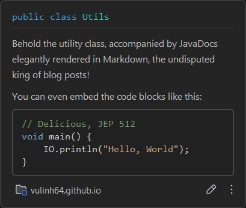

import DateCountdown from '@site/src/components/DateCountdown';

Java 25 drops on September 25 this year (as of August 18, when I'm writing this). Will enterprises immediately jump on the Java 25 hype train? LOL, nope. They'll probably stick with Java 8 until the heat death of the universe (there are tons of breaking changes from Java 21 to Java 25, so without a solid migration plan, your services will explode spectacularly), but hey, we can still have some fun exploring what's new!

<!-- truncate -->

## TL;DR

Too lazy to read? I've got you covered:

<details>

<summary>What we will be getting:</summary>

* JDK 22:

  * [Foreign Function & Memory API](#foreign-function--memory-api-jep-454)

  * [Unnamed Variables & Patterns](#unnamed-variables--patterns-jep-456)

* JDK 23:

  * [Markdown JavaDocs](#markdown-javadocs-jep-467)

* JDK 24:

  * [Stream Gatherers](#stream-gatherers-jep-485)

  * [Synchronize Virtual Threads without Pinning](#synchronize-virtual-threads-without-pinning-jep-491)

  * [Prepare for Quantum Apocalypse](#preparing-for-our-quantum-overlords-jep-496-and-jep-497)

* JDK 25:

  * [Compact Source Files and Instance Main Method](#compact-source-files-and-instance-main-methods-jep-512)

  * [Module Import Declarations](#module-import-declarations-jep-511)

  * [Flexible Constructor Bodies](#flexible-constructor-bodies-jep-513)

</details>

~~Still need to read, but less verbose now.~~

## What's New in JDK 21?

Check this [dedicated article](2025-08-01-java-road-to-21.md) for more information.

## JDK 22

List of JEPs: https://openjdk.org/projects/jdk/22

### Foreign Function & Memory API ([JEP 454](https://openjdk.org/jeps/454))

Current status: **Finalized in JDK 22.**

This JEP is basically Java's way of saying "*JNI, it's not you, it's me... actually, no, it IS you.*" It introduces a shiny new way to talk to code and data outside the Java bubble, replacing the ancient and frankly terrifying JNI. Most of us won't need to touch this beautiful monster, but if you're into that whole "I want blazing performance and I'm not afraid of segfaults" vibe, then buckle up, buttercup!

### Unnamed Variables & Patterns ([JEP 456](https://openjdk.org/jeps/456))

Current status: **Finalized in JDK 22.**

Ever had those awkward moments where you need a variable just to satisfy the compiler's obsessive-compulsive tendencies, but you'll never actually use it? We usually rename them to `ignored` (thanks, IntelliJ!) or just pretend they don't exist. Sure, it works, but it's about as elegant as wearing socks with sandals, and your code quality tools will absolutely lose their minds.

With JEP 456, you can just slap a `_` character (yeah, it kinda looks like a sideways smile 😊 in Markdown) to tell everyone "*I need to declare this variable for reasons, but I'm totally ghosting it, and that's intentional.*"

Take this example:

```java
// What IntelliJ suggests (bless its silicon heart)
list.removeIf(ignored -> LocalDateTime.now().isBefore(threshold));
```

With JDK 22+, you can just:

```java
list.removeIf(_ -> LocalDateTime.now().isBefore(threshold));
```

There are various places where you can unleash this JEP. Read the docs for more chaos!

## JDK 23

List of JEPs: https://openjdk.org/projects/jdk/23

### Markdown JavaDocs ([JEP 467](https://openjdk.org/jeps/467))

Current status: **Finalized in JDK 23.**

Writing JavaDocs is painful? Well, now you can write them in Markdown! Still painful, but at least you're suffering in *style*! It's like getting a root canal, but with prettier formatting.

Take this example:

```java
/// Behold the utility class, accompanied by JavaDocs elegantly rendered in Markdown, the undisputed king of blog posts!
/// 
/// You can even embed code blocks like this:
/// 
/// ```java
/// // Delicious, JEP 512
/// void main() {
///     IO.println("Hello, World");
/// }
/// ```
public class Utils {
    
    // Your utility methods here (probably all static, let's be honest)
}
```

Hovering over the `Utils` class gives us this absolute beauty (proudly presented by IntelliJ):



Your old JavaDocs aren't magically transforming into Markdown (sorry, no fairy godmother here), but expect future docs to bow down to our Markdown overlords while the old HTML-style JavaDocs become digital fossils.

## JDK 24

List of JEPs: https://openjdk.org/projects/jdk/25

### Stream Gatherers ([JEP 485](https://openjdk.org/jeps/485))

Current status: **Finalized in JDK 24.**

Stream Gatherers are basically custom superpowers for your Stream API (they return another `Stream` and mostly just chill until a terminal operation shows up to actually do the work, basically intermediate operations). This JEP is like giving the Stream API steroids: now you can bend streams to your will in ways that would make previous Java developers weep tears of pure joy.

Take this classic headache: filtering by a field that's not the ID.

You've got two choices: wrap your objects in some custom contraption or drag Google Guava into the party with its `Equivalence` wizardry:

#### The Data Class

```java
public record Person(Integer id, String name) {}
```

#### The Guava Approach (A.K.A. "Help, I Need An Adult")

```java
import com.google.common.base.Equivalence;

persons.stream()
    .map(Equivalence.equals().onResultOf(Person::name)::wrap)
    .distinct()
    .map(Equivalence.Wrapper::get)
    .toList();
```

We create an equivalence for `Person` objects using Google Guava's `Equivalence` class (because apparently we need an entire library to compare names). We wrap each object, apply `distinct()` to yeet the duplicates, then unwrap everything. Three stream operations to do what should be simple: peak Java energy!

#### Stream Gatherer Approach (The New Hotness)

First we create our own gatherer:

```java
public class DistinctByNameGatherer implements Gatherer<Person, Set<String>, Person> {

  @Override
  public Supplier<Set<String>> initializer() {
    // Create the state: a HashSet that will track which names we've seen
    return HashSet::new;
  }

  @Override
  public Integrator<Set<String>, Person, Person> integrator() {
    return Integrator.ofGreedy(
        (state, element, downstream) -> {
          // Extract the name from the Person element
          var extracted = element.name();

          // If we haven't seen this name before...
          if (!state.contains(extracted)) {
            // Remember it for posterity
            state.add(extracted);
            
            // Push the Person downstream (keep it in the stream)
            downstream.push(element);
          }
          
          // Always return true because we're optimists
          return true;
        });
  }
}
```

Then we apply our beautiful creation:

```java
persons.stream()
    .gather(new DistinctByNameGatherer())
    .toList();
```

<details>

<summary>Stream Gatherer is parallel-safe (because Java learned from its mistakes):</summary>

The Gatherer API is designed to be parallel-safe. It achieves this by managing state separately for each thread.

* **Thread-Local State**: The `initializer()` method is called once per thread in a parallel stream. This creates a new, independent `Set` for each worker thread, ensuring isolation.

* **Safe Merging**: The Gatherer API has an optional `combiner()` method that defines how separate states from each thread are safely merged.

</details>

You can dig into JEP 485 for the nerdy details, or just download JDK 24 and explore the `java.util.stream.Gatherers` class for some sweet built-in examples!

### Synchronize Virtual Threads without Pinning ([JEP 491](https://openjdk.org/jeps/491))

Current status: **Finalized in JDK 24.**

The dreaded pinning drama with the `synchronized` keyword has been squashed when using Virtual Threads. It only took them... *checks calendar* ...two entire years! Better late than never, right?

But hold your horses: if you're the type who likes to micromanage synchronization (fairness, timeouts, "who gets to go first" politics), you'll still want to cozy up with the classics like `ReentrantLock`, `Semaphore`, or other goodies from the `java.util.concurrent.locks` treasure chest.

<details>

<summary>From The JEP 491 Documentation:</summary>

The `synchronized` keyword in the Java programming language is defined in terms of monitors: Every object is associated with a monitor that can be acquired (i.e., locked), held for a time, and then released (i.e., unlocked). Only one thread at a time may hold an object's monitor. For a thread to run a `synchronized` instance method, the thread first acquires the monitor associated with the instance; when the method is finished, the thread releases the monitor.

To implement the `synchronized` keyword, the JVM tracks which thread currently holds an object's monitor. Unfortunately, it tracks which platform thread holds the monitor, not which virtual thread. When a virtual thread runs a `synchronized` instance method and acquires the monitor associated with the instance, the JVM records the virtual thread's carrier platform thread as holding the monitor — not the virtual thread itself.

If a virtual thread were to unmount inside a `synchronized` instance method, the JDK's scheduler would soon mount some other virtual thread on the now-free platform thread. That other virtual thread, because of its carrier, would be viewed by the JVM as holding the monitor associated with the instance. Code running in that thread would be able to call other `synchronized` methods on the instance, or release the monitor associated with the instance. Mutual exclusion would be lost. Accordingly, the JVM actively prevents a virtual thread from unmounting inside a `synchronized` method.

</details>

Pro tip: JNI calls will still pin your threads like it's 1999, so keep that performance profiler handy!

### Preparing for Our Quantum Overlords: [JEP 496](https://openjdk.org/jeps/496) and [JEP 497](https://openjdk.org/jeps/497)

**TL;DR**: These JEPs are Java's insurance policy against the day quantum computers decide to crack all our encryption like it's a piñata at a toddler's birthday party. Java is future-proofing itself so we don't all panic when quantum computers show up and make RSA weep.

<details>

<summary>The Quantum-Proof Arsenal:</summary>

* **JEP 496** brings us ML-KEM (Module-Lattice-Based Key Encapsulation). Think of it as the bodyguard for your secret keys when they're traveling through sketchy internet neighborhoods.

* **JEP 497** delivers ML-DSA (Module-Lattice-Based Digital Signature Algorithm), your new quantum-proof way to say "*Yes, this message is really from me and nobody tampered with it.*"

Both are NIST-approved and ready to laugh in the face of Shor's algorithm. Good to know Java's got our backs when the quantum apocalypse arrives!

</details>

## Finally, JDK 25

JDK 25 blesses us with these shiny new features (check the dedicated OpenJDK page [here](https://openjdk.org/projects/jdk/25) for the full flavors):

### Compact Source Files and Instance Main Methods ([JEP 512](https://openjdk.org/jeps/512))

Say goodbye to the ancient incantation "public static void main string args". Read this [dedicated article](2025-08-10-main-method-evolution.md) for the full history journey.

### Module Import Declarations ([JEP 511](https://openjdk.org/jeps/511))

Tired of managing seventeen million `import` statements like you're collecting Pokemon cards?

With JEP 511, you can now import all public top-level classes from a module with one glorious declaration:

```java
import module java.base;
```

This simplifies your code and saves your sanity.

Additionally, in compact source files, the `java.base` module is automatically imported, granting immediate access to commonly used classes like `List`, `Set`, and `Date` without the usual import ceremony.

The complete list of packages bundled within `java.base` can be seen [here](https://docs.oracle.com/en/java/javase/21/docs/api/java.base/module-summary.html).

### Flexible Constructor Bodies ([JEP 513](https://openjdk.org/jeps/513))

Tired of this obnoxious error message?

```text
Call to 'super()' must be first statement in constructor body
```

Good news! As of JDK 25, Java finally allows statements before `super(...)` or `this(...)` in constructors. No more juggling validation logic into awkward static helper methods just to appease the compiler gods. Thank you, JEP 513, you beautiful thing!

Now you can write sensible code:

```java
abstract class Member {

  private final String name;

  protected Member(String name) {
    this.name = name;
  }
}

public class ClubMember extends Member {

  private final int age;

  public ClubMember(String name, int age) {
    if (name == null || name.isBlank()) {
      throw new IllegalArgumentException("Name cannot be empty");
    }
    
    if (age < 18) {
      throw new IllegalArgumentException("Must be an adult to register!");
    }
    
    super(name); // No longer needs to be first!
      
    this.age = age;
  }
}
```

Previously, Java forced you into this abomination:

```java
public ClubMember(String name, int age) {
  super(parseName(name)); // at the top, or no compile!
  this.age = parseAge(age);
}

private static String parseName(String name) {
  if (name == null || name.isBlank()) {
    throw new IllegalArgumentException("Name cannot be empty");
  }
  
  return name;
}

private static int parseAge(int age) {
  if (age < 18) {
    throw new IllegalArgumentException("Must be an adult to register!");
  }
  
  return age;
}
```

An ugly workaround: validation logic banished to static methods just to satisfy arbitrary language rules. Yikes...

Still:

Code before `super(...)` or `this(...)` may only perform safe operations (validating parameters, assigning fields, computing values), but cannot access the instance under construction (no `this`, instance methods, or field reads).

The constructor must still call exactly one `super(...)` or `this(...)` on all paths.

This change brings long-overdue ergonomics improvements and aligns the language with how the JVM actually works.

#### Bonus Meme: Valhalla When?

Quoted from JEP 513 documentation:

> JEP 401, from Project Valhalla, proposes value classes and builds upon this work. When the constructor of a value class does not contain an explicit constructor invocation then an implicit constructor invocation is considered to implicitly appear at the end of the constructor body, rather than the beginning. Thus all of the statements in such a constructor constitute its prologue, and its epilogue is empty.

Can we expect [JEP 401](https://openjdk.org/jeps/401) to enter first preview in JDK 26? Or will we be fighting against the `Ragnarök` itself before Project Valhalla is made a reality?


*Sure, the meme doesn't quite fit, but honestly, Project Valhalla has become something of a legendary meme among Java developers by now.*

## Counting down to JDK 25 Release Date

How many days until the big day?

<DateCountdown to='2025-09-16' description='JDK 25 Release Date'></DateCountdown>

## Incompatibility Reports with JDK 25 Early Access

Some of the notable incompatibility problem I've encountered when testing JDK 25 Early Access:

<details>

* Lombok `1.18.38` does not work with JDK 25.

* Maven Surefire plugins requires this configuration for Mockito:

    ```xml
    <configuration>
        <argLine>
            -javaagent:${settings.localRepository}/org/mockito/mockito-core/${mockito.version}/mockito-core-${mockito.version}.jar
            -Xshare:off
        </argLine>
    </configuration>
    ```

</details>