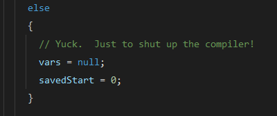

Continuing from [part 1](2025-07-21-funny-java-comments.md), we bask ourselves in some of the "funniest" comments found in various Java libraries.

<!-- truncate -->

## What Was a [Charmander](https://www.pokemon.com/us/pokedex/charmander) Doing Here?

From `com.google.common.base.CharMatcher` class, line 68:

Because `CharMatcher` sounds like Charmander (maybe), a Pokémon, we get beautiful ASCII art here! Reason? For lulz I guess?

## Yuck! Please Shut Up, Compiler!

From `com.sun.org.apache.xpath.internal.axes.BasicTestIterator` class, line 162

Yes, compiler, please stop nagging me with that senseless variable assignment!

## Oops! I Couldn't Load the Native Library

From `java.lang.ClassLoader` class, line 2283:

Oops, all attempts at loading the native library failed! Too bad!

## Ouch! No Hard Drives Found!

From `sun.awt.shell.Win32ShellFolder2` class, line 411:

When no non-removable hard drive is present, the system returns a generic `C:\\` as the fallback option.

Also, look at that hellish nested code. It wouldn't pass modern quality gates. Perhaps the developers were rushing to meet a deadline back then? 

Here's some consolation: don't worry if you write bad code, you will improve. Everyone writes bad code at some point, even the Java makers themselves!

## I Dare You To Mock that `List`

From `org.mockito.Mockito` class, line 3128 (yes, finding the class declaration at line 1775 requires archaeological skills, and I'm convinced the JavaDoc-to-code ratio here violates several laws of physics):

The Mockito codebase reads like a developer comedy special: equal parts helpful advice and existential dread about bad testing practices. But their dramatic warnings come with genuinely good sense: don't mock `List` when `ArrayList` and `LinkedList` are sitting right there, eager to be actual lists in your tests. It's the difference between hiring a stunt double to breathe for you versus just... breathing.

~~Don't burn in hell, please!~~

## Oh Mighty Aphrodite, Please Bless Us With Security

From `sun.security.provider.JavaKeyStore` class, line 824:

You need such a ~~mighty~~ secure salt to add into your password for extra ~~salty~~ safety!

