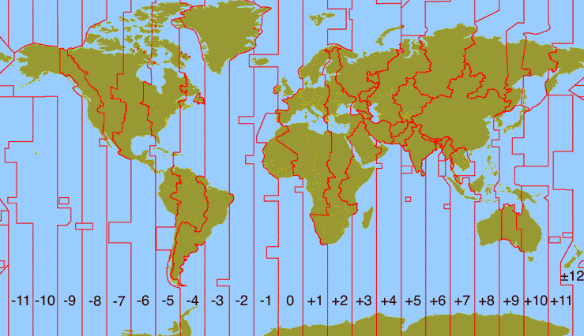

import { CJK } from '@site/src/components/CJK/cjk.tsx';
import { XCJKB } from '@site/src/components/CJK/cjk-block.tsx';

Listen, I'm just going to say it: dealing with date and time in programming is [***one of the circles of hell Dante forgot to mention***](https://en.wikipedia.org/wiki/Inferno_(Dante)). It's right there between "*people who talk in movie theaters*" and "*folks who don't use version control.*"

<!-- truncate -->

<details>

<XCJKB>

皆さん、こんばんは

この一年、いかがお過ごしでしたか。

多くの成果に恵まれた一年でしたか。それとも、困難と向き合う一年でしたか。

どのような一年であったとしても、今この瞬間、旧年から新年へと移り変わるこの時に、ほんのひととき、悲しみや苦労を忘れましょう。

グラスを掲げ、共に歌い、新年を祝いましょう。

明けましておめでとうございます！

</XCJKB>

</details>

## The Earth Is Big

So here's the thing. Earth is pretty darn big. Big enough that we have [multiple time zones](https://en.wikipedia.org/wiki/Sandford_Fleming#Inventor_of_worldwide_standard_time) because, you know, the sun can't shine everywhere at once. Revolutionary concept, I know.

But wait, it gets better.

## When One Country Isn't Enough

Russia? Oh, Russia spans ELEVEN time zones. That's right. You could start a Zoom call in Kaliningrad and by the time it reaches Kamchatka, people are practically in tomorrow.

And France! Cute little France with its obsession with baguettes and the Eiffel Tower? Thanks to their overseas territories scattered across the globe, they're chilling in TWELVE time zones. Twelve! That's more time zones than letters in "*bonjour.*"

## China's "*One Time Zone to Rule Them All*" Policy

Then you have China, which geographically spans about 4 or 5 time zones but politically said "*nah, we're good*" and made the entire country UTC+8. Imagine living in western China where the sun rises at like 10 AM because Beijing said so. That's commitment to unity right there (and you DON'T get to object).

## Alternative Calendar Systems (For Extra Spice)

Oh, you thought we were done?

We haven't even talked about the fact that [Thailand uses a Buddhist calendar](https://en.wikipedia.org/wiki/Thai_calendar); or [Japan has its Japanese era name system](https://en.wikipedia.org/wiki/Japanese_era_name) (nengō - <CJK>年号</CJK>) tied to imperial reigns; or half of East Asia (Vietnam, China, Korea) runs [lunar calendars](https://en.wikipedia.org/wiki/Lunisolar_calendar) in parallel with the [Gregorian one we use every day](https://en.wikipedia.org/wiki/Gregorian_calendar).

And even among countries using lunar calendars, there are subtle differences: Vietnam and China occasionally celebrate Lunar New Year on different dates due to time zone differences, with a notable example in 1985 when Vietnam celebrated a month before China.

Then the Islamic countries use the [Hijri calendar](https://en.wikipedia.org/wiki/Islamic_calendar), a purely lunar calendar comprising 12 lunar months in a year of 354 or 355 days, which is why Ramadan shifts through the seasons each year.

And let's not forget that Russia used the old [Julian calendar](https://en.wikipedia.org/wiki/Adoption_of_the_Gregorian_calendar#Adoption_in_Eastern_Europe) until 1918. That's why the October Revolution is celebrated on November 7th (October 25th in the Julian calendar) instead.

<details>

<summary>When Controlling Time Meant Winning Wars</summary>

Here's a fun historical tidbit about the power of calendar manipulation: Julius Caesar (the creator of the Julian calendar) wasn't just a military genius, he was also the [Pontifex Maximus (Chief High Priest)](https://en.wikipedia.org/wiki/Pontifex_maximus) of Rome, which meant he controlled time itself, ***literally***. The Pontifex Maximus had the power to decide when intercalary months would be added to the Roman calendar, and since these positions were often held by politicians, the calendar became a political tool: a Pontifex could lengthen a year when he or his allies were in office, or refuse to add days when opponents held power.

By 50 BC, Caesar had been so [preoccupied with his campaigns in Gaul](https://en.wikipedia.org/wiki/Gallic_Wars) and then [the civil war he caused](https://en.wikipedia.org/wiki/Caesar%27s_civil_war) that there had been only one intercalation since he became proconsul. The calendar had drifted about three months ahead of the seasons at this point.

Here's where it gets interesting: In January 48 BC, Caesar crossed the Adriatic Sea to Greece to pursue [Pompey](https://en.wikipedia.org/wiki/Pompey). But because the Roman calendar had drifted so badly, what the calendar called "January" was actually late autumn in reality. Everyone expected Caesar to wait until spring when weather and winds would be better for crossing, because crossing in winter was extremely lethal. They were shocked when Caesar showed up in January with seven legions, taking the Pompeians completely by surprise because nobody crosses the Adriatic in "winter," except when winter isn't really winter on the actual calendar.

You can win battles if you can literally control what day it is. Caesar used the calendar drift (which he himself had caused by neglecting his Pontifex Maximus duties) to his strategic advantage. By the time he reformed the calendar in 46 BC, creating the Julian calendar we still use today, he'd already leveraged that chaos to become dictator of Rome.

Talk about the ultimate time zone hack: ignore your calendar duties for years, let the calendar drift into chaos, use that chaos to surprise your enemies, then fix the calendar and get credit for bringing order to Rome.

Absolute legend.

Just thank Jupiter for not having programming back then!

</details>

Thank goodness you rarely need to work with those in your average web app. But they're there. Lurking. Waiting to ruin your sprint planning.

## The Ultimate Heresy: Daylight Saving Time

But the REAL villain here? The absolute worst offender?

[***Daylight Saving Time***](https://en.wikipedia.org/wiki/Daylight_saving_time).

Because the Earth had the ***AUDACITY*** to tilt on its axis, humans decided to mess with clocks twice a year to "save daylight." Most European countries do it. Most of the U.S. does it. Arizona looked at DST and said "*absolutely nope*," and I respect them for that.

The sheer chaos of "spring forward, fall back" has caused more bugs than I care to count. Your code that worked perfectly in February suddenly breaks in March because SURPRISE, an hour just vanished!

<details>

<summary>DST Experiments: A Global Comedy of Errors</summary>

Many countries have experimented with observing DST over the years, with varying (and often hilarious) results. Russia [tried permanent DST from 2011 to 2014](https://en.wikipedia.org/wiki/Daylight_saving_time_in_Russia), which led to health issues and increased morning traffic accidents because people were waking up in darkness. They finally said "*enough*" and stopped using DST in October 2014.

But here's the absolute worst-case scenario: imagine being born during the DST fall back, when clocks "fall back" an hour. In 2016, [twin boys were born in Massachusetts](https://www.fox13seattle.com/news/twins-born-as-daylight-saving-time-ends-cause-rare-age-twist) where Samuel arrived at 1:39 AM, and his brother Ronan was born 31 minutes later. But because DST ended between their births and clocks fell back one hour, Ronan's official birth time was recorded as 1:10 AM. So on paper, the younger twin became the older twin!

Pray that you don't need to explain to your kids why one of them is technically "older" despite being born second. Or worse, pray you don't need TWO birth certificates to explain which one is the "real" birth time and which one is the "DST adjusted" time. Because that's a parent-teacher conference I wouldn't want to attend.

</details>

You thought DST is purely aesthetic?

***WRONG***! ***BIG*** WRONG!

This is one of the biggest sources of bugs that have caused endless headaches to developers all around the world!

### The Non-Existent Hour

When clocks "spring forward" at 2:00 AM to 3:00 AM, any time between 2:00 AM and 3:00 AM simply doesn't exist.

If you schedule a meeting for 2:30 AM on that day, congratulations! You've just defined something that doesn't exist in spacetime. Your code thinks it's valid (without proper validations and adjustments). Your calendar thinks it's valid. But the universe is laughing at you (and your boss is furious with you) because that timestamp is literally impossible.

### The Duplicate Hour

Even worse? When clocks "fall back" from 2:00 AM to 1:00 AM, every time between 1:00 AM and 2:00 AM happens twice.

You log an event at 1:30 AM. Great! But which 1:30 AM? The first one or the second one? Did this error occur before or after DST ended? Your log timestamp says 1:30 AM, but that could mean two completely different moments in time. Did your scheduled tasks run twice? Did it cause a nuclear meltdown because of time misconfiguration? Uh oh...

Read the Date-Time API. Handle the correct timestamps, for the temporal God's sake! And don't you dare use that (not good) old `java.util.Date`, or we need to talk!

<details>

<summary>Real World Casualties: The Gaming Industry's DST Nightmare</summary>

Want to see DST chaos in action? Look at the online gaming industry, particularly games with daily login rewards.

Picture this: You've been logging into your favorite mobile game every single day for 200 days straight. You're maintaining that precious login streak, collecting those daily rewards. Then DST hits. Suddenly, the "day" boundary shifts by an hour. You log in at your usual time and... nothing. You've "missed" a day even though you logged in. Streak broken. Rewards gone. Players furious.

On the other hand, you might receive daily login rewards TWICE (which might be a curse disguised as a blessing)! And that forced the desperate devs to do an emergency rollback!

One example is the mobile game **Azur Lane** (**Global Server**). Initially, the game used **Pacific Standard Time** (**PST**), which observes DST. Due to various bugs involving daily logins during the time change, it was decided that the server would instead run on **Mountain Standard Time** (UTC-7). Thank you, Arizona!

The core issue? When your business model depends on daily engagement and your rewards are tied to "days," you can't have your definition of a "day" shifting around twice a year. UTC+0 doesn't observe DST (because it's a standard, not a political time zone), making it the safe choice for any system that needs consistent 24-hour periods.

This is why experienced game developers now default to UTC for all server-side operations and only convert to local time for display purposes. Because nothing says "we value your engagement" quite like accidentally resetting someone's 365-day login streak because Congress decided clocks should jump forward an hour.

</details>

## Geography Doesn't Care About Your Grid System

And don't even get me started on how time zone boundaries follow geographical and political borders instead of nice, neat longitude lines. It's a wiggly, squiggly mess that makes about as much sense as pineapple on pizza (I said what I said).

<details>

<summary>Geographical Lessons Time!</summary>

The worst offender has to be North America, where [time zone boundaries couldn't even stay in straight lines](http://www.physicalgeography.net/fundamentals/2c.html). Thank you, various U.S. states, for imposing your own funny thinking about which time zone is superior. Picture that proud and superior backend engineer who stored everything in UTC, while frontend developers scrambled to display times that tried to make sense of which county in Indiana decided it was Eastern Time this week.



Technically, China's time zone boundaries "hug" its national borders rather than following longitude lines, but whatever. Other countries didn't buy China's "one time zone for everyone" shenanigans and went with the geographically sensible approach instead.

</details>

## The Solutions

### Embrace the Time Zone Neutrality

So what's a developer to do? Simple: use time zone-independent data types.

<details>

<summary>What We Do in Java</summary>

In Java, we have `LocalDateTime` and `Instant`. Let me show you:

```java
// LocalDateTime: no timezone, just date and time
var localNow = LocalDateTime.now();
System.out.println("Local: " + localNow);

// Instant: a point in time (UTC based)
var instantNow = Instant.now();
System.out.println("Instant: " + instantNow);

// ZonedDateTime: for when you need timezone info
// Perfect for user facing times!
var zonedNow = ZonedDateTime.now(ZoneId.of("Asia/Ho_Chi_Minh"));
System.out.println("Zoned (Vietnam): " + zonedNow);

// Convert ZonedDateTime to Instant for storage
var fromZoned = zonedNow.toInstant();
System.out.println("Stored as Instant: " + fromZoned);

// OffsetDateTime: fixed offset, no DST shenanigans
// Good for when you hate DST but want to preserve the offset
var offsetNow = OffsetDateTime.now(ZoneOffset.of("+07:00"));
System.out.println("Offset +7: " + offsetNow);

// But pray you're not in UTC +5 region of China...
var chinaWest = OffsetDateTime.now(ZoneOffset.of("+05:00"));
System.out.println("What you want: " + chinaWest);

// Government says UTC +8 regardless!
var chinaOfficial = ZonedDateTime.now(ZoneId.of("Asia/Shanghai"));
System.out.println("What government wants: " + chinaOfficial);
```

</details>

Store everything in UTC (as `Instant`), do your business logic in time zone-independent types (`LocalDateTime`, assuming your server has proper time zone configuration), and only convert to local time zones when displaying to users. That's it. That's the secret sauce.

### Instant Is Too Cold and Emotionless?

I get it. Sometimes `Instant` feels too abstract, too detached from reality. You want your API requests to feel more... human. More relatable. That's where `ZonedDateTime` comes in!

<details>

<summary>`ZonedDateTime` in Action!</summary>

Here's the beautiful workflow:

1. **Frontend creates requests using `ZonedDateTime`**: Let users work in their own time zone. Create timestamps with full time zone awareness. It's natural, it's intuitive, it's what they expect.

2. **Backend converts to `Instant` immediately**: As soon as that request hits your server, convert it to `Instant` (or `LocalDateTime` if your server is running at UTC+0). Store it. Process it. Do all your business logic with it:

    ```java
    var zonedDateTime =
        ZonedDateTime.of(
            LocalDate.of(2025, Month.JULY, 16),
            LocalTime.of(10, 25, 0),
            ZoneId.of("Asia/Ho_Chi_Minh"));

    // Prints "2025-07-16T03:25:00Z"
    var instant = zonedDateTime.toInstant();
   
    // Prints "2025-07-16T10:25", 
    // assuming you are also in Vietnam timezone (UTC +7)
    var localDateTime = zonedDateTime.toLocalDateTime();
    ```

3. **Worry-free!** No more "but what time zone was this in?" questions. No more DST bugs. No more time zone drift.

</details>

### Still Hate DST But Want Fixed Offsets?

Use `OffsetDateTime`! It gives you a fixed offset from UTC without any DST nonsense. You say UTC+7, you get UTC+7. No spring forward, no fall back. Just pure, unadulterated offset.

**But here's the catch**: If you're in western China and you insist on using UTC+5 because that's where you geographically should be, well... the Chinese government would like a word. They'll have none of your UTC+5 fantasies and will firmly remind you that ALL of China is UTC+8. Because unity. Because politics. Because reasons.

So, while `OffsetDateTime` is great for dodging the headache of Daylight Saving Time, it won't save you from the whims of local governments and their sudden time zone edicts. Honestly? Nothing can protect you from politics. Also, because it isn't DST-aware, only use it if your data is the "source of truth" and you're prepared to own that timestamp come rain, shine, or legislative chaos.

<details>

<summary>The Era Before Java 8</summary>

Now, if you're stuck with Java 7 or earlier... well, I'm sorry. You better have Joda-Time API in your dependencies, or you're going to have a bad time. And if your project manager is one of those "we don't add external dependencies" types? My condolences. May the odds be ever in your favor.

```xml
<!-- https://mvnrepository.com/artifact/joda-time/joda-time -->
<dependency>
    <groupId>joda-time</groupId>
    <artifactId>joda-time</artifactId>
    <version>2.14.0</version>
</dependency>
```

</details>

## The Bottom Line

Having a single, unified time representation that doesn't care about political borders, geographical weirdness, or humanity's bizarre relationship with daylight is the ONLY way to keep your app time-safe and time-aware.

Because at the end of the day (pun intended), time is complicated enough without us making it worse. Let's all agree to store UTC, think in instants, and leave the time zone conversion drama for the presentation layer where it belongs.

Your future self, debugging a time zone issue at 3 AM (or 2 AM, if DST is messing with you), will thank you.