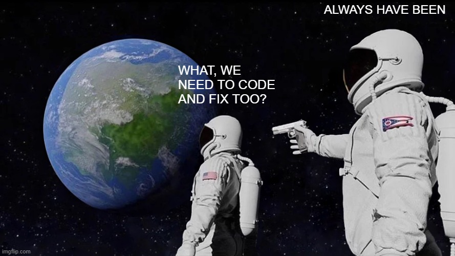

The A.I. storm is approaching, provoking dread and fear in isolation!

{/* truncate */}

We are living in strange, weird, and honestly kind of hilarious times.

Somewhere out there, right now, someone is standing on a metaphorical rooftop screaming into the void: "*I can ship products faster than your entire dev team, and I don't even know how to code!*" And the crowd below? They're nodding. They're clapping. Someone's making a LinkedIn post about it.

And here's the uncomfortable part: they're not entirely wrong.

## Coding Is Dead?

For proof-of-concept projects, quick demos, or anything that sits comfortably within well-trodden territory, AI-assisted development is genuinely astounding. You can go from a napkin idea to a working prototype before your senior dev finishes their morning standup rant about why the ticket wasn't properly scoped. It's fast, it's impressive, and it makes for great conference talks.

> Yes, I did such a project here: https://github.com/vulinh64/spring-base-frontend

Which brings us to the statement. You've heard it. Probably from a non-tech manager in a quarterly meeting, delivered with the confidence of someone who just discovered ChatGPT last Tuesday:

:::danger

*Learning to code is dead. Just learn to use AI instead.*

:::

Ah yes. The "just" did a lot of heavy lifting there, didn't it?

That statement is, with all due respect, fundamentally wrong. And here's why.

## AI is Not God, It's More Like a Very Fast Intern

People have this fascinating tendency to treat AI as if it descended from the heavens: infallible, omniscient, incapable of error. It is none of those things.

AI is trained on existing codebases. Human-written codebases. Written by humans who, shockingly, are human. And humans? Humans are messy, fallible, and occasionally brilliant in the worst possible ways.

Need proof? Cast your mind back to [Log4Shell](https://en.wikipedia.org/wiki/Log4Shell): one of the most catastrophic security vulnerabilities in recent memory, hiding inside one of the most widely used logging libraries in the Java ecosystem. Or consider [the joy of supply chain attacks on NPM](https://www.trendmicro.com/en_us/research/25/i/npm-supply-chain-attack.html), where a single compromised package can detonate across thousands of projects like a very unwelcome surprise party. Fellow humans did that. Brilliant, experienced, well-meaning humans.

If humans can produce that level of spectacular disaster, then yes, AI, trained on the very code those humans wrote, is absolutely capable of confidently generating its own flavor of catastrophe. With clean formatting, no less.

Open any popular repository right now. You won't find a pristine, perfect codebase sitting in peaceful retirement. You'll find hundreds of open PRs, active issues, heated debates in comment threads, and patches on patches on patches. Code is never done, at least until its life cycle ends. It evolves, breaks, gets fixed, and breaks again in exciting new ways. AI learns from this ever-shifting landscape. And so do we.

Also, and this is important: AI cannot transcend its own limitations. It operates within boundaries. It can't alter the fundamental laws of computing any more than you can wish away an O(n²) algorithm. It's a powerful tool, not a reality-warping deity.

## You Still Need to Know Why

Here's where the leg day analogy earns its paycheck.

You can skip leg day for a while. You'll look fine from the waist up. But eventually, you'll try to run and your knees will file a formal complaint.

Same with skipping the basics of programming.

To correct AI's mistakes, and it will indeed make mistakes: you need to understand the fundamentals. You need to know why firing database queries inside a for loop is a heresy against performance (a classic move by interns and the AI alike). You need to know why Thread Pool exists and what happens when you don't use one. You need to know why `System.out.println` in production is the coding equivalent of shouting sensitive information across a crowded restaurant.

Because when the AI confidently hands you code that works perfectly in a dev environment and melts down under real load, someone needs to look at it and say, "*Ah yes, I see the problem*". That someone needs to understand what they're looking at.

You cannot fix what you cannot comprehend. And that means you cannot skip learning the basics.

Coding and fixing are an inseparable pair. Always have been, always will be.

## About Those "*I Don't Code*" PoC Projects

Let's circle back to our rooftop shouter and their impressive AI-built project.

It works great in the demo. Smooth, clean, everyone's impressed. Investor eyes are sparkling.

Then actual users show up.

Edge cases emerge. Traffic spikes. Someone tries to do something slightly unexpected and the whole thing collapses like a poorly-stacked Jenga tower in an earthquake. Why? Because the project only ever scratched the surface. It never had to wrestle with performance, security, reliability, or scalability. All the unglamorous pillars that hold any real product upright.

And here's the thing that gets lost in all the "*AI can replace developers*" discourse: coding is just one stage of building software. Making it faster is genuinely great! But it's not a silver bullet.

There's requirement definition. There's testing (a lot of testing). There's code review (a lot of reviewing). There's scaling. There's the 4 AM incident where something fell over in production and nobody knows why. Making the coding part faster is an improvement to one act of a very long play.

## A Word About Senior Devs

Why are senior developers respected? Not because they type faster. Not because they know every framework. It's because they have seen things. Unspeakable things. Production incidents that would make your hair stand on end. Systems that collapsed in ways nobody thought geometrically possible.

And they got humbled. And they got better.

Senior devs don't need a dazzling stage. They need things to work. Quietly, reliably, sustainably. They're the ones backstage making sure the lights don't fall on the performers.

None of them got there by skipping the basics. Every single one of them, at some point, had to understand why something worked, either by watching other suffers, or being in such cases themselves.

## Learning to Prompt Well

Times change. Adaptability is the name of the game, and the game has genuinely shifted.

Learning to write effective prompts is now a real, legitimate skill, right alongside understanding data structures and debugging a memory leak at midnight. This isn't a diminishment of either discipline. It's an expansion.

The sweet spot? Knowing both.

Let AI assist you. It's fast, it's capable, and it'll happily generate a solution in seconds. But guide it. Correct it. Instruct it to not commit the classic blunders: I/O calls inside loops, calling a `@Transactional` method from within the same class (Spring developers know the quiet rage of this one), or any number of sins that look fine until they very much aren't.

That's not dependency. That's symbiosis. You learn from AI. AI (through its training) learns from humans. It's a productive, mutually beneficial relationship: the kind that actually ships good software.

## Don't Skip Leg Day.

The metaphor lands, I hope.

You can't build a strong foundation on shortcuts. You can't debug what you don't understand. You can't lead AI toward a correct solution if you don't know what "correct" looks like.

To the junior devs reading this: Don't lose heart. The landscape looks intimidating right now: new tools, loud voices, constantly shifting ground. Learn the basics. Understand the core problems. Let AI be your accelerator, not your replacement. The fundamentals will always be your compass.

To the senior devs: Your hard-won knowledge and battle-tested intuition are not obsolete. They're more valuable now than ever, because someone has to know when the AI is confidently wrong. Now you just get to move faster — with better prompts, sharper instincts, and hopefully a little less of the Friday chaos.

And to everyone else: the next time someone says "*learning to code is dead*", kindly remind them that someone still needs to understand why it broke.