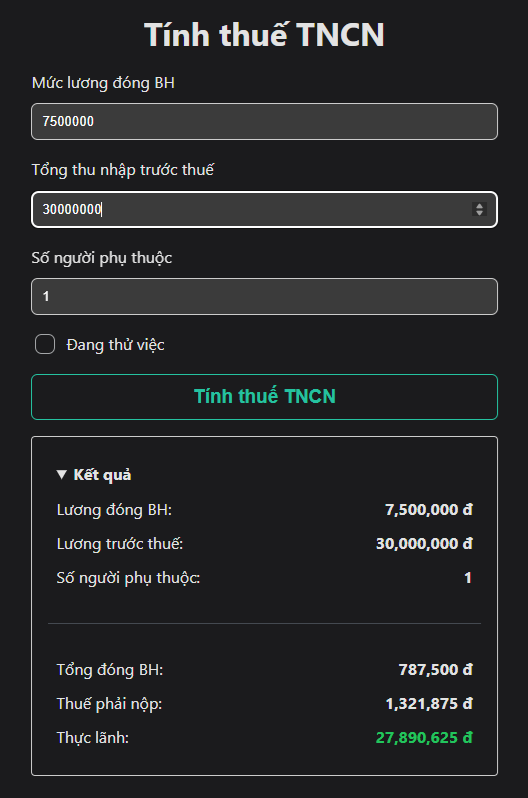
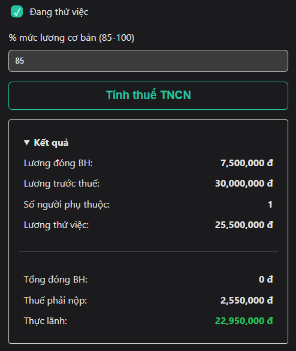

import Link from '@docusaurus/Link';

# Cách Tính Thuế TNCN Đơn Giản (Cập Nhật 2025)

<hr />

Đây là bài viết hướng dẫn nhanh cách các bạn tự tính thuế TNCN và thu nhập thực nhận của bạn theo luật LĐ của Việt Nam, tính đến thời điểm hiện tại (2025).

<!-- truncate -->

<sub>Nguồn ảnh: [luatvietnam.vn](https://english.luatvietnam.vn/latest-news/2-cases-are-ineligible-for-personal-income-tax-exemption-in-house-trading-4727-97267-article.html)</sub>


Bạn có thể trải nghiệm công cụ tính thuế TNCN dưới đây:

<Link style={{'margin-left': 'auto', 'margin-right': 'auto'}} to='/tax-calculator' className='button button--outline button--primary button--lg button--block margin-top--sm margin-bottom--xl'>Công cụ tính thuế TNCN</Link>

## Thử Việc

Nếu bạn đang thử việc thì bạn có thể bỏ qua các phần khác.

Đối với thử việc thì các quy định về BH và giảm trừ gia cảnh sẽ **không được áp dụng**.

* Theo quy định, mức lương thử việc tối thiểu **phải bằng 85% lương thỏa thuận chính thức của công việc**.

    * Do đó, việc các công ty đưa ra mức % thấp hơn 85% là **vi phạm pháp luật**.

    <details>

    <summary>Theo **Điều 10 Nghị định 12/2022/NĐ-CP**</summary>

    Phạt tiền từ **500.000 đồng** đến **1.000.000 đồng** đối với người sử dụng lao động có một trong các hành vi sau đây:

    a. Yêu cầu thử việc đối với người lao động làm việc theo hợp đồng lao động có thời hạn dưới **01** tháng;

    b. Không thông báo kết quả thử việc cho người lao động theo quy định.

    Phạt tiền từ **2.000.000 đồng** đến **5.000.000 đồng** đối với người sử dụng lao động có một trong các hành vi sau đây:

    a. Yêu cầu người lao động thử việc quá **01** lần đối với một công việc;

    b. Thử việc quá thời gian quy định;

    c. Trả lương cho người lao động trong thời gian thử việc thấp hơn **85%** mức lương của công việc đó;

    d. Không giao kết hợp đồng lao động với người lao động khi thử việc đạt yêu cầu đối với trường hợp hai bên có giao kết hợp đồng thử việc.

    **Tham khảo**: https://thuvienphapluat.vn/van-ban/Lao-dong-Tien-luong/Nghi-dinh-12-2022-ND-CP-xu-phat-vi-pham-hanh-chinh-lao-dong-bao-hiem-nguoi-lam-viec-nuoc-ngoai-479312.aspx?anchor=dieu_10

    </details>

* Nếu thu nhập thử việc vượt quá **11.000.000 VNĐ/tháng**, bạn phải đóng thuế TNCN. Mức đóng thuế TNCN sẽ là **10%** trên tổng thu nhập.

Nếu bạn đã hoàn thành thử việc và ký HĐLĐ chính thức, bạn hãy tiếp tục đọc phần dưới đây:

## Lương Tối Thiểu

Theo Nghị định số [**74/2024/NĐ-CP**](https://thuvienphapluat.vn/van-ban/Lao-dong-Tien-luong/Nghi-dinh-74-2024-ND-CP-muc-luong-toi-thieu-lao-dong-lam-viec-theo-hop-dong-603278.aspx) ban hành ngày **30/06/2024**, mức lương tối thiểu của người lao động được tính như sau:

|    Vùng    | Mức lương tối thiểu/tháng | Quy đổi ra lương/giờ | Đơn vị |
|:----------:|:-------------------------:|:--------------------:|-------:|
|   Vùng I   |         4.960.000         |        23.800        |    VNĐ |
|  Vùng II   |         4.410.000         |        21.200        |    VNĐ |
|  Vùng III  |         3.860.000         |        18.600        |    VNĐ |
|  Vùng IV   |         3.450.000         |        16.600        |    VNĐ |

Như vậy, để đơn giản, thì công cụ tính thuế TNCN sẽ mặc định mức lương cơ bản đóng bảo hiểm **không được thấp hơn** mức cơ sở là **3.450.000** VNĐ.

Theo [quy định](https://thuvienphapluat.vn/phap-luat/ho-tro-phap-luat/cach-tinh-muc-luong-dong-bhxh-tu-01-7-2024-khi-tang-luong-toi-thieu-vung-cong-thuc-tinh-luong-dong--163276.html) thì từ **01/07/2024**, mức đóng BH tối đa sẽ là **46.800.000 VNĐ**.

## Giảm Trừ Gia Cảnh

Theo Nghị quyết số [**954/2020/UBTVQH14**](https://thuvienphapluat.vn/van-ban/Thue-Phi-Le-Phi/Nghi-quyet-954-2020-UBTVQH14-dieu-chinh-muc-giam-tru-gia-canh-cua-thue-thu-nhap-ca-nhan-444106.aspx), ban hành ngày **02/06/20200**, áp dụng từ ngày **01/07/2020**, điều chỉnh mức giảm trừ gia cảnh quy định tại [**khoản 1 Điều 19 của Luật Thuế thu nhập cá nhân số 04/2007/QH12**](https://luatvietnam.vn/thue/luat-thue-thu-nhap-ca-nhan-2007-33914-d1.html) như sau:

* Mức giảm trừ đối với đối tượng nộp thuế là **11.000.000 VNĐ** (**132.000.000** VNĐ/năm)

* Mức giảm trừ đối với mỗi nguời phụ thuộc là **4.400.000 VNĐ**/người

## Mức Đóng Bảo Hiểm

Hiện tại, mức đóng bảo hiểm của người lao động (có hợp đồng chính thức) được [quy định ngắn gọn](https://thuvienphapluat.vn/phap-luat/ho-tro-phap-luat/ty-le-dong-bhxh-bat-buoc-bhyt-bhtn-tu-ngay-0172025-chi-tiet-the-nao-ty-le-dong-bhxh-tu-1-7-2025-co--218917.html) như sau:

* Mức đóng BHXH: **8%**

* Mức đóng BH thất nghiệp: **1%**

* Mức đóng BHYT: **1.5%**

* Tổng cộng: **10.5%**

Mức đóng bảo hiểm của người lao động sẽ được tính dựa trên mức lương đóng bảo hiểm đã được thỏa thuận trong hợp đồng lao động (HĐLĐ), chứ không phải tổng thu nhập trước thuế.

### Ví dụ

:::tip[Ví Dụ]

Bạn ký HĐLĐ với công ty A, trong đó lương cơ bản là **7.500.000 VNĐ** và phụ cấp là **22.500.000 VNĐ** (tổng lương là **30.000.000 VNĐ**). Khi đó, khoản tiền bảo hiểm bạn phải đóng hàng tháng sẽ được tính trên mức lương cơ bản là **7.500.000 VNĐ**, cụ thể như sau:

* Bảo hiểm xã hội (BHXH): **600.000 VNĐ**

* Bảo hiểm thất nghiệp (BHTN): **75.000 VNĐ**

* Bảo hiểm y tế (BHYT): **112.500 VNĐ**

* Tổng cộng: **600.000** + **75.000** + **112.500** = **787.500 VNĐ**

:::

## Biểu Thuế Lũy Tiến Từng Phần

Lấy thu nhập của bạn trừ đi mức đóng BHXH và giảm trừ gia cảnh để tính thu nhập chịu thuế của bạn.

Sau đó xác định bậc thuế lũy tiến của bạn, xem bảng sau:

| Bậc thuế |              Thu nhập chịu thuế              | Thuế suất |
|:--------:|:--------------------------------------------:|:---------:|
|    1     |            đến **5.000.000 VNĐ**             |    5%     |
|    2     | từ **5.000.000 VNĐ** đến **10.000.000 VNĐ**  |    10%    |
|    3     | từ **10.000.000 VNĐ** đến **18.000.000 VNĐ** |    15%    |
|    4     | từ **18.000.000 VNĐ** đến **32.000.000 VNĐ** |    20%    |
|    5     | từ **32.000.000 VNĐ** đến **52.000.000 VNĐ** |    25%    |
|    6     | từ **52.000.000 VNĐ** đến **80.000.000 VNĐ** |    30%    |
|    7     |        từ **80.000.000 VNĐ** trở lên         |    35%    |

### Ví dụ HĐLĐ Chính thức

<details>

<summary>Ví dụ tính thuế TNCN cho HĐLĐ chính thức</summary>

Lấy ví dụ ở phần [mức đóng bảo hiểm](#ví-dụ) ở trên, cộng thêm với có 1 người phụ thuộc (ví dụ bạn có con dưới 18 tuổi), ta có thu nhập chịu thuế của bạn là:

```
30000000 - 787500 - 11000000 - 1 * 4400000 = 13812500 (VNĐ)
```

Như vậy, thu nhập chịu thuế của bạn sẽ là **13.812.500 VNĐ**.

Như vậy, thu nhập của bạn thuộc vào **bậc 3** (từ **10.000.000 VNĐ** đến **18.000.000 VNĐ**)

Tổng cộng số tiền thuế bạn phải nộp là:

```text
5000000 * 5 / 100 + 5000000 * 10 / 100 + (13812500 - 10000000) * 15 / 100 = 1321875 (VNĐ)
```

Như vậy, thực lãnh của bạn sẽ là:

```text
30000000 - 787500 - 1321875 = 27890625 (VNĐ)
```

Bạn có thể xem tính toán:

|           |
|:--------------------------------------------------------------------------------------------:|
| *Bạn có thể tự trải nghiệm việc tính thuế TNCN ở đường [link](/tax-calculator) đầu bài viết* |

</details>

### Ví dụ Thử việc

<details>

<summary>Tính toán cho HĐ thử việc</summary>

Nhưng nếu bạn đang thử việc với % lương thử việc là 85% thì sao?

Lương thử việc trước thuế sẽ là:

```text
30000000 * 85 / 100 = 25500000 (VNĐ)
```

Bạn phải nộp 10% vào thuế TNCN, do vậy, bạn sẽ phải nộp:

```text
25500000 * 10 / 100 = 2550000 (VNĐ)
```

Và thực lãnh của bạn sẽ là:

```text
25500000 - 2550000 = 22950000 (VNĐ)
```

Bạn có thể xem ảnh sau:



</details>

## Bonus

* Bạn có thể tham khảo chương trình mẫu viết bằng Java để tính thuế TNCN tại [đây](https://github.com/vulinh64/spring-base/tree/main/src/main/java/com/vulinh/service/taxcalculator)

* Hoặc bạn có thể xem source code tính thuế TNCN bằng JavaScript của blog này tại [đây](https://github.com/vulinh64/vulinh64.github.io) (source code của website này)

* Tặng bạn chương trình viết bằng Python (dù mình không giỏi Python lắm) 😁

    <details>
    
    ```python showLineNumbers
    # Constants for tax calculation
    INSURANCE_RATES = {
        "social": 0.08,
        "health": 0.015,
        "unemployment": 0.01,
    }
    
    NON_TAXABLE_INCOME_DEDUCTION = 11_000_000
    DEDUCTION_PER_DEPENDANT = 4_400_000
    PROBATION_TAX_RATE = 0.1
    MINIMUM_BASIC_SALARY = 3_450_000
    MAXIMUM_BASIC_SALARY = 46_800_000
    MINIMUM_PROBATION_PERCENTAGE = 85
    MAXIMUM_PROBATION_PERCENTAGE = 100
    
    TAX_LEVELS = [
        {"threshold": 0, "rate": 0.0},
        {"threshold": 5_000_000, "rate": 0.05},
        {"threshold": 10_000_000, "rate": 0.10},
        {"threshold": 18_000_000, "rate": 0.15},
        {"threshold": 32_000_000, "rate": 0.20},
        {"threshold": 52_000_000, "rate": 0.25},
        {"threshold": 80_000_000, "rate": 0.30},
        {"threshold": float('inf'), "rate": 0.35}
    ]
    
    
    def calculate_vietnam_tax(base_salary, gross_salary, number_of_dependants, 
                             is_probation=False, probation_percentage=100):
        """
        Calculate Vietnam tax based on salary and personal information.
        
        Args:
            base_salary (float): Basic salary amount
            gross_salary (float): Gross salary amount
            number_of_dependants (int): Number of dependants
            is_probation (bool): Whether employee is on probation
            probation_percentage (float): Percentage of salary during probation
            
        Returns:
            dict: Dictionary containing tax calculation results
        """
        # Cap basic salary at MAXIMUM_BASIC_SALARY for calculations
        capped_base_salary = min(base_salary, MAXIMUM_BASIC_SALARY)
    
        if is_probation:
            probation_salary = gross_salary * (probation_percentage / 100)
            taxed_amount = (0 if probation_salary < 11_000_000.0 
                           else round(probation_salary * PROBATION_TAX_RATE))
            net_salary = probation_salary - taxed_amount
    
            return {
                "insurance_amount": 0,
                "taxed_amount": taxed_amount,
                "net_salary": round(net_salary),
                "is_probation": True,
                "probation_salary": round(probation_salary),
                "capped_base_salary": round(capped_base_salary),
            }
    
        # Calculate insurance amounts
        social_insurance = capped_base_salary * INSURANCE_RATES["social"]
        health_insurance = capped_base_salary * INSURANCE_RATES["health"]
        unemployment_insurance = capped_base_salary * INSURANCE_RATES["unemployment"]
        insurance_amount = social_insurance + health_insurance + unemployment_insurance
    
        # Calculate pre-tax salary and deductions
        pretax_salary = gross_salary - insurance_amount
        dependant_deduction = number_of_dependants * DEDUCTION_PER_DEPENDANT
    
        taxable_income = pretax_salary - NON_TAXABLE_INCOME_DEDUCTION - dependant_deduction
    
        if taxable_income < 0:
            taxable_income = 0
    
        # Calculate progressive tax
        tax_amount = 0
        tax_level_ordinal = 0
    
        while tax_level_ordinal < len(TAX_LEVELS) - 1:
            current_level = TAX_LEVELS[tax_level_ordinal]
            next_level = TAX_LEVELS[tax_level_ordinal + 1]
            delta_to_next_level = taxable_income - current_level["threshold"]
    
            if delta_to_next_level <= 0:
                break
    
            delta = (delta_to_next_level if taxable_income < next_level["threshold"] 
                    else next_level["threshold"] - current_level["threshold"])
    
            if delta > 0:
                tax_amount += delta * next_level["rate"]
    
            tax_level_ordinal += 1
    
        net_salary = gross_salary - insurance_amount - tax_amount
    
        return {
            "insurance_amount": round(insurance_amount),
            "taxed_amount": round(tax_amount),
            "net_salary": round(net_salary),
            "is_probation": False,
            "capped_base_salary": round(capped_base_salary),
        }
    
    
    class TaxCalculator:
        """
        A class to handle tax calculations with form-like state management.
        """
        
        def __init__(self):
            self.form_data = {
                "basic_salary": "",
                "gross_salary": "",
                "dependants": 0,
                "on_probation": False,
                "probation_percentage": "",
            }
            self.errors = {}
            self.warnings = {}
            self.result = None
        
        def set_form_data(self, **kwargs):
            """Update form data with provided keyword arguments."""
            for key, value in kwargs.items():
                if key in self.form_data:
                    self.form_data[key] = value
        
        def calculate(self):
            """Calculate tax based on current form data."""
            try:
                basic_salary = float(self.form_data["basic_salary"]) if self.form_data["basic_salary"] else 0
                gross_salary = float(self.form_data["gross_salary"]) if self.form_data["gross_salary"] else 0
                dependants = int(self.form_data["dependants"])
                on_probation = self.form_data["on_probation"]
                probation_percentage = (float(self.form_data["probation_percentage"]) 
                                      if self.form_data["probation_percentage"] else 100)
                
                self.result = calculate_vietnam_tax(
                    basic_salary, gross_salary, dependants, on_probation, probation_percentage
                )
                return self.result
                
            except ValueError as e:
                self.errors["calculation"] = f"Invalid input: {e}"
                return None
    
    
    def get_user_input():
        """Get tax calculation inputs from user via keyboard."""
        print("=== Vietnam Tax Calculator ===")
        print("Enter your salary information:")
        
        try:
            # Get basic salary
            while True:
                basic_salary_str = input("Basic salary (VND): ").strip().replace(",", "").replace(".", "")
                if basic_salary_str.isdigit():
                    basic_salary = float(basic_salary_str)
                    break
                print("Please enter a valid number for basic salary.")
            
            # Get gross salary
            while True:
                gross_salary_str = input("Gross salary (VND): ").strip().replace(",", "").replace(".", "")
                if gross_salary_str.isdigit():
                    gross_salary = float(gross_salary_str)
                    break
                print("Please enter a valid number for gross salary.")
            
            # Get number of dependants
            while True:
                dependants_str = input("Number of dependants (0 if none): ").strip()
                if dependants_str.isdigit():
                    dependants = int(dependants_str)
                    break
                print("Please enter a valid number for dependants.")
            
            # Ask if on probation
            while True:
                probation_input = input("Are you on probation? (y/n): ").strip().lower()
                if probation_input in ['y', 'yes']:
                    on_probation = True
                    break
                elif probation_input in ['n', 'no']:
                    on_probation = False
                    break
                print("Please enter 'y' for yes or 'n' for no.")
            
            # Get probation percentage if on probation
            probation_percentage = 100
            if on_probation:
                while True:
                    prob_perc_str = input("Probation percentage (85-100%): ").strip()
                    try:
                        probation_percentage = float(prob_perc_str)
                        if MINIMUM_PROBATION_PERCENTAGE <= probation_percentage <= MAXIMUM_PROBATION_PERCENTAGE:
                            break
                        else:
                            print(f"Please enter a percentage between {MINIMUM_PROBATION_PERCENTAGE}% and {MAXIMUM_PROBATION_PERCENTAGE}%.")
                    except ValueError:
                        print("Please enter a valid number for probation percentage.")
            
            return basic_salary, gross_salary, dependants, on_probation, probation_percentage
        
        except KeyboardInterrupt:
            print("\n\nCalculation cancelled by user.")
            return None
    
    
    def display_results(result):
        """Display the tax calculation results in a formatted way."""
        print("\n" + "="*50)
        print("TAX CALCULATION RESULTS")
        print("="*50)
        
        if result["is_probation"]:
            print(f"Status: On Probation")
            print(f"Probation Salary: {result['probation_salary']:,} VND")
            print(f"Insurance Amount: {result['insurance_amount']:,} VND")
            print(f"Tax Amount: {result['taxed_amount']:,} VND")
            print(f"Net Salary: {result['net_salary']:,} VND")
        else:
            print(f"Status: Regular Employee")
            print(f"Capped Base Salary: {result['capped_base_salary']:,} VND")
            print(f"Insurance Amount: {result['insurance_amount']:,} VND")
            print(f"Tax Amount: {result['taxed_amount']:,} VND")
            print(f"Net Salary: {result['net_salary']:,} VND")
        
        print("="*50)
    
    
    def main():
        """Main function to run the interactive tax calculator."""
        while True:
            user_input = get_user_input()
            
            if user_input is None:  # User cancelled
                break
                
            basic_salary, gross_salary, dependants, on_probation, probation_percentage = user_input
            
            # Calculate tax
            result = calculate_vietnam_tax(
                base_salary=basic_salary,
                gross_salary=gross_salary,
                number_of_dependants=dependants,
                is_probation=on_probation,
                probation_percentage=probation_percentage
            )
            
            # Display results
            display_results(result)
            
            # Ask if user wants to calculate again
            while True:
                again = input("\nWould you like to calculate for another person? (y/n): ").strip().lower()
                if again in ['y', 'yes']:
                    print("\n" + "-"*50 + "\n")
                    break
                elif again in ['n', 'no']:
                    print("Thank you for using Vietnam Tax Calculator!")
                    return
                print("Please enter 'y' for yes or 'n' for no.")
    
    
    # Example usage:
    if __name__ == "__main__":
        # Run the interactive calculator
        main()
    ```
    
    </details>